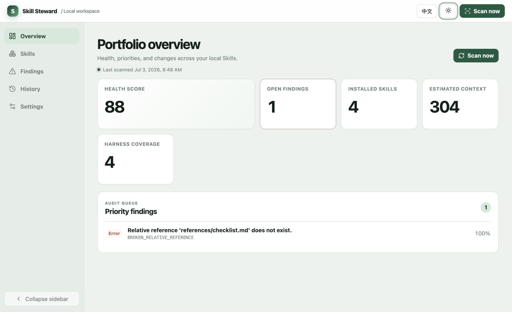
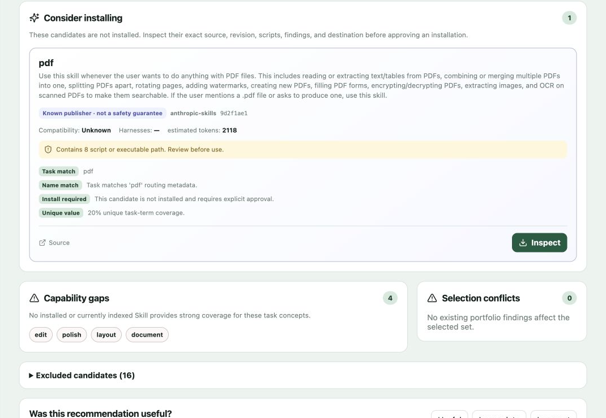
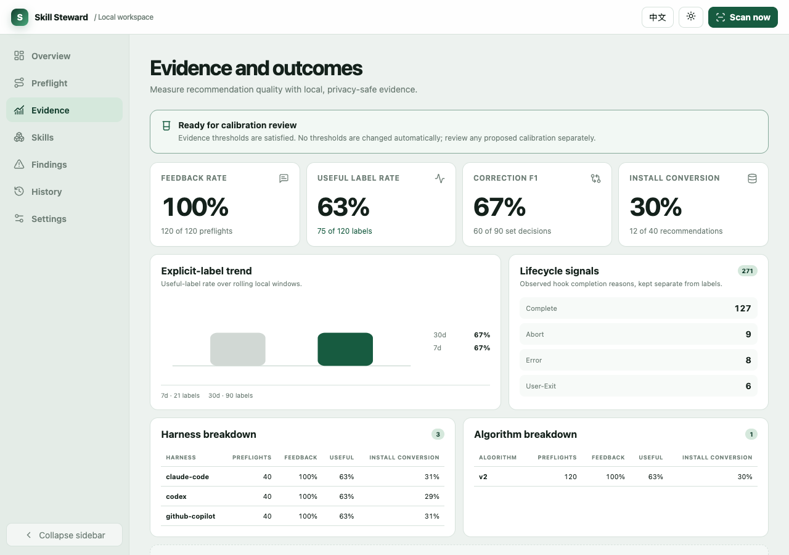
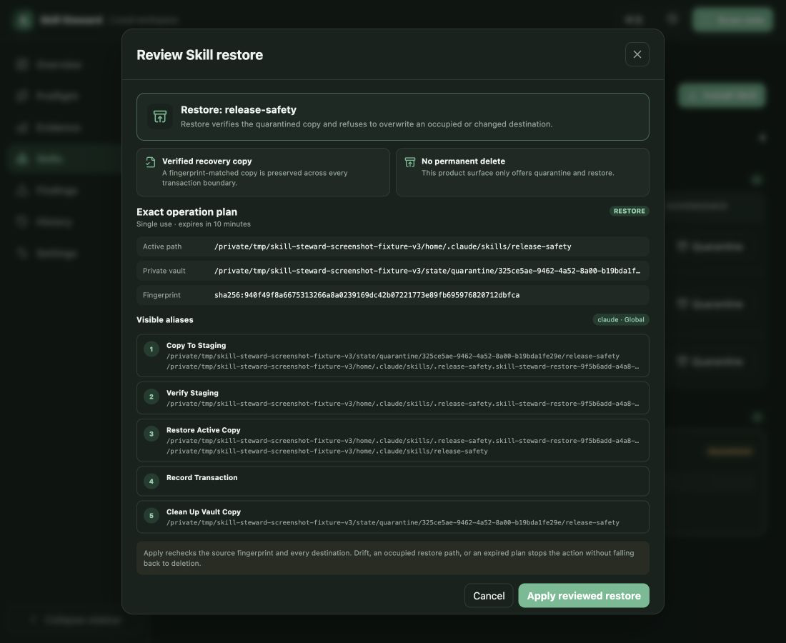
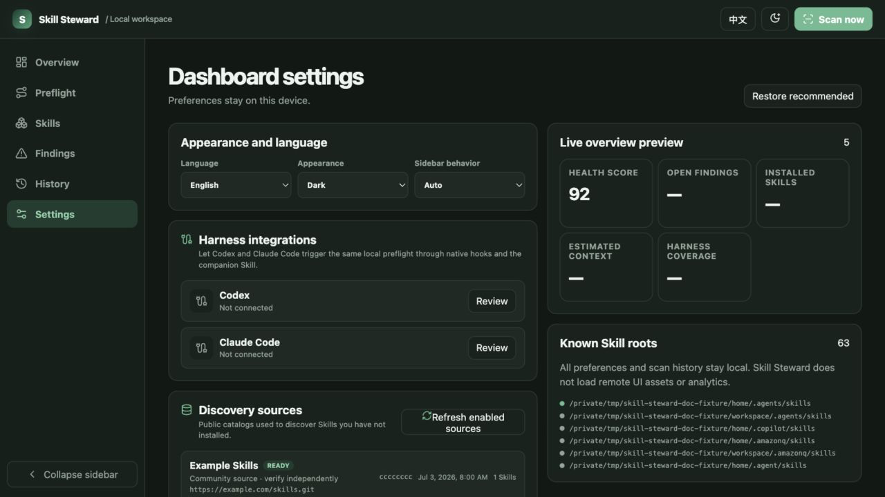

# Skill Steward

English | [简体中文](README.zh-CN.md)

Know which Agent Skills you have, which ones a task needs, and change them safely.

Skill Steward is a cross-Harness companion and local control console for Agent Skills. Its three core adapters give Codex, Claude Code, and GitHub Copilot CLI one proof-aware inventory and one reviewed mutation contract; the wider Harness catalog uses directory conventions where native behavior has not been verified.

It is not another Harness: it does not answer prompts, route models, or run agents. Your Harness keeps doing the work; Skill Steward helps it choose a small, relevant Skill set and keeps Skill changes reviewable and reversible.

> Status: active alpha. Install from source or a local tarball; the npm package is not published yet.

## Three jobs

### 1. Understand your Skill portfolio

Scan standard user and project Skill directories for 30 Harnesses, inspect complete bundles, and see duplicate content, broken references, oversized context, scripts, executables, portability problems, and scope overlap in one local dashboard.

### 2. Preflight the current task

Compare the task with both installed Skills and candidates from public catalogs you explicitly enabled. A bounded English/Chinese capability model separates incidental word overlap from action-and-object intent, then selects the smallest set that adds distinct value. Results separate **Use now**, **Consider installing**, **Capability gaps**, and **Excluded**, so an uninstalled candidate is visible without being treated as already trusted.

### 3. Make reviewed, reversible changes

Inspect the source revision and exact filesystem plan before installation. Confirmed changes use provenance, backups, drift checks, and rollback. Quarantine and restore remove a Skill from active use without offering permanent deletion.

### Why keep it installed

- **Task-time help, not another destination:** Codex and Claude Code prompt Hooks can run Preflight where a request starts. Copilot remains observe-only and gets recommendations through the companion Skill or CLI.
- **One view across tools:** direct and plugin-managed Skills are resolved into one proof-aware inventory instead of being counted by directory presence alone.
- **Safe local operations:** installation, integration, shared-consumer disconnect, final uninstall, quarantine, restore, and rollback use exact reviewed plans and stop on drift.
- **Recovery after interruption:** if a managed integration stops midway, the same local evidence derives one safe rollback or finalize direction for review in the CLI, loopback API, or dashboard. The direction cannot be overridden and there is no force write.

The ranking is deterministic and local; it does not require an LLM. Your Harness still decides whether and how to use a recommended Skill.

## Native inventory visibility

Finding a directory does not prove the Harness can use the Skill. Core native inventory adapters for Codex, Claude Code, and GitHub Copilot CLI inspect documented local direct and plugin Skill surfaces, then the report and UI show three separate kinds of state:

- **Source statuses:** `scanned`, `missing`, `unreadable`, `invalid`, `disabled`, `stale`, `ambiguous`, `truncated`
- **Harness coverage:** `verified`, `partial`, `unavailable`, `convention-only`
- **Skill exposure:** `effective`, `shadowed`, `inactive`, `ambiguous`

Copilot Harness coverage can remain `partial` when local runtime or MDM evidence is incomplete. An affected source or Skill exposure can remain `ambiguous` when local files do not prove activation or precedence.

Native plugin-managed Skills are read-only in Skill Steward governance; manage them through the owning Harness. Skill Steward quarantine and restore apply only to directly managed Skills. Across the total 30 Harnesses, coverage outside the three core adapters is convention-only directory inventory/install coverage where native semantics have not been verified.

A scan is a current-workspace snapshot plus user scopes; it does not crawl every project or workspace.

## Screenshots

These views use local example data to show populated states; the scores and evidence counts are not project usage results.











Screenshots in this README use the English locale. The [Chinese README](README.zh-CN.md) uses the matching Chinese captures.

## Installation

### Requirements

- Node.js 22 or newer
- pnpm 10 or newer to build the local package

### Install the verified local CLI package

Until the npm package is published, build and install the same verified tarball that the repository tests. The first-value commands below then use one global `skill-steward` binary from start to finish.

```bash
git clone https://github.com/CongBao/skill-steward.git
cd skill-steward
pnpm install --frozen-lockfile
package_dir="$(mktemp -d)"
pnpm --filter skill-steward pack --pack-destination "$package_dir"
npm install --global "$package_dir"/skill-steward-*.tgz
skill-steward --version
```

SSH works too:

```bash
git clone git@github.com:CongBao/skill-steward.git
```

If an older global build is already installed, repack and reinstall it before testing repository changes. Check the active binary with `skill-steward --version`.

For source-development setup and the full contributor quality checks, see [CONTRIBUTING.md](CONTRIBUTING.md).

The packed CLI includes its package `README.md`, MIT `LICENSE`, generated `THIRD_PARTY_NOTICES.txt`, and a machine-readable third-party manifest. The artifact verifier checks real npm and pnpm tarballs against the trusted build tree and the source-controlled `runtime-audit.json`; normal builds fail rather than silently rewriting that audit.

## First use

The shortest useful path is one scan, one real task, and the dashboard:

```bash
skill-steward scan
skill-steward preflight \
  --task "Review this TypeScript change for security regressions and missing tests" \
  --harness codex
skill-steward dashboard
```

Any available catalog recommendation always shows its Candidate ID. Because this example supplies an explicit supported Harness, it also prints a complete reviewed preview command. When the catalog does not declare a scope, that command targets only the current project with `--scope project`; the CLI resolves the omitted workspace to the current directory. It never guesses a Harness or silently widens the destination to global scope.

This path does not change any Skill or Harness configuration. It does write the latest local report and privacy-reduced Preflight evidence under `~/.skill-steward`; the raw task is not stored. An installation preview creates a plan but does not install anything. Apply only the exact `--plan <id> --confirm` command it prints after review. The same preview-first rule applies to integration, policy, and governance changes.

For a headless inventory or report:

```bash
skill-steward doctor --json
skill-steward discover --json
skill-steward report --format markdown
```

State is stored in `~/.skill-steward`. Override that location without changing the Skill roots:

```bash
SKILL_STEWARD_HOME=/path/to/private/state skill-steward dashboard --no-open
```

## Task preflight

Task Preflight answers two questions before work starts:

1. Which installed Skills add distinct value now?
2. Which not-yet-installed Skills could fill a meaningful gap?

```bash
skill-steward preflight --task-file ./task.txt --max-skills 3
printf '%s' "Review this pull request" | skill-steward preflight --stdin --compact-json
skill-steward preflight --task "Review this pull request" --installed-only
```

Algorithm v9 is a deterministic local ranker, not an LLM or a general semantic search engine. It combines lexical relevance with a versioned English/Chinese workflow grammar that recognizes bounded actions, objects, and local action-object pairs. Selection rewards uncovered capabilities, penalizes redundant candidates, preserves risk and Harness eligibility gates, and includes estimated context cost. Explicit negative instructions keep rejected capabilities out; broad nouns such as “Skill”, “code”, or “agent” cannot activate a candidate alone. Capability gaps appear only when the evidence is specific enough to be a plausible Skill search hint. The public 28-case benchmark reports 96.3% precision, 92.9% recall, 92.9% exact-set accuracy, 92.9% bilingual decision parity, and zero negative-control false positives. Run it with `pnpm test:preflight-quality`. These numbers describe the included synthetic corpus, not every possible task or real-world task success. Exact boundaries are documented in [Architecture](docs/architecture.md#task-time-data-flow) and the [Alpha testing protocol](docs/alpha-testing.md#compact-and-bilingual-preflight).

Use `--compact-json` for Harness or companion-Skill handoff. Compact schema v4 emits one line and at most 4,096 UTF-8 bytes, with selected use/install recommendations and stable warning codes but no raw task or capability details. Its feedback command is `null` when evidence persistence failed. `--json` returns the complete `PreflightResult`; full result schema v5 adds capability coverage, capability precision, and trigger confidence alongside candidate decisions, scores, features, reasons, conflicts, inventory warnings, capability gaps, and aggregate coverage. Available catalog candidates may include catalog `source` metadata. It does not embed native inventory source, ownership, plugin, or exposure records. The portfolio reports and dashboard preserve those records; Preflight consumes resolved visibility and expresses relevant outcomes through candidate reason codes and inventory warnings. Companion Hooks remain capped at 2,048 bytes.

If the private state directory is readable but cannot be written by the current Harness sandbox, Preflight still returns the recommendation with exit code zero. It emits `PREFLIGHT_PERSISTENCE_UNAVAILABLE`, does not expose the failed path, and makes clear that this run cannot accept feedback because its report and evidence were not saved.

Human CLI output includes the Preflight run ID and, when the run was saved, a direct feedback command. Full candidate and reason details remain available with `--json`.

```bash
skill-steward evidence feedback --preflight <run-id> --label useful
skill-steward evidence feedback \
  --preflight <run-id> \
  --label incomplete \
  --candidate <complete-correct-candidate-set>
```

For `incomplete`, `--candidate` is the complete set that should have been recommended, including any original recommendations that were already correct. This keeps correction metrics meaningful.

The raw task text is never written to disk. Stored evidence contains only allow-listed hashes, IDs, aggregate counts, numeric scores, source IDs, and optional feedback.

### Opt-in discovery sources

All built-in sources start disabled:

- [OpenAI Plugins](https://github.com/openai/plugins), scanning Skills nested in public plugin bundles;
- [Anthropic Skills](https://github.com/anthropics/skills);
- [Awesome GitHub Copilot](https://github.com/github/awesome-copilot), classified as a community source.

Enable and refresh sources explicitly:

```bash
skill-steward catalog enable openai-plugins
skill-steward catalog refresh
skill-steward catalog list --json
```

Custom sources must be credential-free public HTTPS Git repositories. Adding a source leaves it disabled. Refresh is the only networked indexing step; Hooks and Preflight use the validated local cache with no prompt-time network access. “Known publisher” describes repository ownership, not safety.

## Evidence and data policy

The **minimal mode is the default**. It retains privacy-reduced Preflight metadata and explicit `useful`, `incomplete`, or `incorrect` feedback, but no lifecycle correlation keys or ranking feature snapshots.

Learning mode is opt-in. It adds bounded numeric feature snapshots—including capability coverage, capability precision, and trigger confidence—and content-free Hook events with HMAC-SHA256 pseudonyms. It never stores the extracted capability names or pairs. A private per-install salt is stored with mode `0600` and is never included in export, API responses, or the dashboard. Prompts, extracted terms, working-directory paths, raw session/turn IDs, transcripts, assistant messages, tool arguments, and tool output are excluded.

```bash
skill-steward evidence policy --json
skill-steward evidence policy set --mode learning --retention-days 30 --max-events 5000
skill-steward evidence policy set --plan <id> --confirm
skill-steward evidence summary --json
skill-steward evidence export --output ./skill-steward-evidence.json
skill-steward evidence compact
skill-steward evidence erase
skill-steward evidence erase --plan <id> --confirm
```

The request without `--confirm` creates an exact, expiring plan. Apply only with the emitted ID: `--plan <id> --confirm` loads that same plan in a later process instead of rebuilding it from new arguments. Plans are single-use; a claimed plan that encounters drift or another apply-time failure is consumed, and the CLI asks for a fresh preview. Retention is configurable from 7 to 365 days and lifecycle storage from 100 to 10,000 events.

The Evidence dashboard shows the numerator and denominator for feedback rate, useful/incomplete/incorrect labels, corrected-set precision/recall/F1, and provenance-only install conversion. It separates lifecycle reasons from explicit labels and compares Harnesses, algorithm versions, and rolling 7/30-day windows. **Lifecycle completion is not task success.** Calibration review requires at least **100 labeled preflights**, 30 corrected candidate sets, and 20 portfolio fingerprints. **No ranking threshold or weight changes automatically**; calibration would require a separate reviewed release.

## Harness integration

Skill Steward can connect Codex, Claude Code, and GitHub Copilot CLI without replacing them. The managed Hook observes the native lifecycle; the shared companion Skill gives the Harness an explicit task-preflight tool. JSON status v3 keeps those two pieces separate, including each target, reason, availability, and the companion proof category. The temporary Alpha top-level aliases have been removed, so consumers read the nested `hook` and `companion` domains directly. A connected Hook therefore cannot hide a missing, outdated, modified, or unreadable companion:

```bash
skill-steward integrate status --json
skill-steward integrate plan --harness codex
skill-steward integrate plan --harness claude-code
skill-steward integrate plan --harness github-copilot
```

Each preview persists the exact Hook change, companion bundle, packaged source, ownership proof, record head, and consumer set. Apply uses the emitted single-use plan, revalidates every bound field under one cross-process lease, and publishes the companion, Harness configuration, readiness report, and history as one transaction. A definite failure before finalize restores the exact prior state; uncertain publication, lease loss, or failed compensation keeps recovery evidence and reports `recovery-required` instead of guessing.

```bash
skill-steward integrate apply --plan <plan-id> --confirm
skill-steward integrate remove --harness codex
skill-steward integrate remove --plan <plan-id> --confirm
```

Interrupted integration recovery is global because all three adapters share one companion Skill and one mutation lease. Status is read-only. A recoverable state first produces a single-use plan whose `rollback` or `finalize` direction comes from the exact transaction and lifecycle record; `unknown` evidence offers diagnostics but no mutation.

```bash
skill-steward integrate recovery status --json
skill-steward integrate recovery plan
skill-steward integrate recovery apply --plan <plan-id> --confirm
```

Recovery covers interrupted create, upgrade, connect, retained disconnect, and final uninstall transactions on supported POSIX platforms. Apply revalidates the record, transaction sequence, artifact roles, platform, and plan expiry under the shared lease. A partial recovery remains blocked with a fresh-plan instruction instead of reporting success. Windows CI verifies native journal identities, junction refusal, Win32 manifest modes, and fail-closed planning, but recovery and lifecycle writes remain unavailable until native reparse detection and handle-relative mutation authority are implemented.

Disconnect removes the reviewed Harness Hook and updates the proven consumer set. The shared companion stays in place while another Harness still uses it. When the last proven consumer disconnects, Skill Steward removes only the exact tree recorded at installation; a modified, unreadable, or unproved tree is left untouched. This uses recorded installed evidence rather than the current package, so an unchanged older companion can still be uninstalled after an upgrade. Create, upgrade, and final uninstall use the packaged no-replace native helper for the current platform. Missing or unsupported helpers block the write instead of falling back to a racy filesystem operation.

Managed Hooks fail open and use cached local state. Codex and Claude Code cover `UserPromptSubmit` and completion Hooks and receive a compact recommendation rather than raw task text or catalog URLs. Codex may still require its native trust review. GitHub Copilot CLI is intentionally observe-only: its documented Hook records lifecycle evidence, while recommendations remain available through the companion Skill or explicit CLI Preflight.

## Harness capability matrix

| Harness | Managed events | Recommendation | Local evidence |
|---|---|---|---|
| Codex | `UserPromptSubmit`, `Stop` | Recommend + observe through the prompt Hook | Turn lifecycle |
| Claude Code | `UserPromptSubmit`, `Stop`, `SessionEnd` | Recommend + observe through the prompt Hook | Turn and session lifecycle |
| GitHub Copilot CLI | `userPromptSubmitted`, `sessionEnd` | **Observe only**; recommendations via companion Skill/CLI | Prompt observation and session lifecycle |

All three adapter configurations are tested with temporary-HOME fixtures and preserve unrelated configuration. “Observe only” is deliberate: the Copilot adapter does not inject recommendations into prompts.

## Supported harnesses

The root catalog covers 30 Harnesses: Amazon Q, Antigravity, Auggie, Bob, Claude Code, Cline, CodeBuddy, Codex, ForgeCode, Continue, CoStrict, Crush, Cursor, Factory, Gemini CLI, GitHub Copilot, iFlow, Junie, Kilo Code, Kimi, Kiro, Lingma, Vibe, OpenCode, Pi, Qoder, Qwen Code, RooCode, Trae, and Windsurf.

Across the total 30 Harnesses, coverage outside the three core adapters provides convention-only directory inventory and installation. Native workflow integration is narrower still and is described exactly in the capability matrix.

## How safe installation works

Skill Steward never installs a recommendation automatically. A catalog recommendation follows the same reviewed flow as a folder, ZIP, or public Git source:

1. **Inspect** — resolve the recorded commit and recheck fingerprint, files, scripts, executables, references, and findings.
2. **Choose destination** — select Harness, global/project scope, workspace, and target name.
3. **Resolve conflicts** — identical content is a no-op; different content requires a rename or explicit replacement.
4. **Confirm** — review the exact filesystem operations.
5. **Apply** — create or replace atomically, record provenance, and rescan the portfolio.
6. **Rollback** — restore the backup only while destination drift checks still pass.

For a catalog candidate, preview first and then run the exact command it prints:

```bash
skill-steward install --catalog-candidate <candidate-id> --harness codex --scope global
skill-steward install --plan <id> --confirm
```

The preview keeps the inspected source in private staging until the plan is applied or expires. Apply reuses that staged content in a later process, checks source and destination fingerprints again, and never restages from the network behind the reviewed plan.

Installation apply and rollback share one state-scoped cross-process lease with managed Harness changes. The CLI acquires it before consuming the reviewed plan and checks the destination again after preparing the verified copy. Concurrent replacements therefore serialize: a stale waiter stops on drift instead of overwriting the newer installation or recording the wrong backup.

ZIP traversal, absolute paths, links, case-folding collisions, excessive entries, and expansion limits are rejected. Git staging is non-interactive, disables repository Hooks and submodules, and never executes source content.

## Reversible governance

Quarantine removes an installed Skill from active discovery without deleting it permanently. It creates and verifies a private copy, moves the active directory atomically through a rollback location, commits the vault copy, and records the transaction. Restore verifies the vault again and refuses an occupied destination, an expired plan, or source/destination drift.

```bash
skill-steward govern history --json
skill-steward govern quarantine --skill <skill-id>
skill-steward govern quarantine --plan <id> --confirm
skill-steward govern restore --transaction <quarantine-id>
skill-steward govern restore --plan <id> --confirm
```

The dashboard exposes the same operation plan. There is no Delete action. Recovery keeps at least one verified copy if a transaction fails at copy, verification, move, vault, journal, or restore boundaries.

## Comparison

Skill Steward is strongest for developers who use several Harnesses and want local task selection plus reviewed, reversible operations. Native products remain the best-integrated experience inside their own Harness; package managers and registries are stronger at broad distribution, dependency locking, or hosted evaluation. Comparison checked **2026-07-05** against the linked product documentation.

| Product | Primary job | Task-time selection | Cross-Harness lifecycle |
|---|---|---|---|
| **Skill Steward** | Proof-aware local inventory, task Preflight, evidence, and reversible governance | **Ranks installed and opt-in catalog candidates for the current task** | **Three core adapters share reviewed Hook + companion transactions, exact final uninstall, and user-visible evidence-derived recovery across CLI/API/Dashboard; convention-only inventory elsewhere** |
| [Microsoft APM](https://microsoft.github.io/apm/) | Declarative agent-context package management with manifest, lockfile, transitive dependencies, policy, and CI audit | Installs and compiles declared packages; audit checks integrity and deployment drift | Deploys several primitive types across supported Harnesses with reproducible lockfile and policy controls |
| [skills.sh](https://www.skills.sh/docs) | Public directory, leaderboard, security checks, and one-command cross-agent Skill installation | Discovery and popularity ranking before install | Installs GitHub-hosted Skills into supported agents; lifecycle centers on CLI install/update |
| [Tessl](https://docs.tessl.io/) | Versioned Skill registry, evaluation, distribution, and optimization | Registry search plus measured quality/impact before install | Agent-agnostic package installation and hosted evaluation lifecycle |
| [Codex Skills and Plugins](https://developers.openai.com/codex/plugins) | Native Codex Skills, plugins, marketplace, and Hooks | Native discovery and invocation inside Codex | Codex-native enable, disable, and uninstall controls |
| [Claude Code Skills and Plugins](https://code.claude.com/docs/en/discover-plugins) | Native Claude Code Skills, plugins, marketplaces, and Hooks | Native discovery and invocation inside Claude Code | Claude-native install, update, enable, disable, and remove controls |
| [GitHub Copilot Agent Skills](https://docs.github.com/en/copilot/concepts/agents/about-agent-skills) | Native Copilot Skills and Hooks across supported Copilot surfaces | Native discovery and invocation inside Copilot | Copilot-native Skill and Hook management |

## Privacy and security

- The server binds to `127.0.0.1` and rejects unexpected Host and Origin values.
- Packaged UI assets are same-origin and load no remote fonts, scripts, images, or analytics.
- Mutations require a random per-process token held by the local page.
- Dashboard read APIs do not return complete Skill bodies.
- Prompt-time Preflight uses cached state and does not contact catalog sources.
- Minimal evidence is the default; learning mode requires a reviewed policy change.
- Persisted evidence excludes task text, extracted terms, descriptions, reasons, URLs, local paths, transcripts, assistant content, tool data, and raw Harness IDs.
- Sanitized export and API responses never include the private HMAC salt.
- Installation-source scripts, package managers, build commands, repository Hooks, and submodules are not executed.
- CLI installation, integration apply, evidence-policy, evidence-erasure, quarantine, and restore plans are persisted privately, expire, and are single-use; confirmation never regenerates a plan from request arguments.
- Installation, integration, and disconnect mutations share a cross-process lease. Integration create/upgrade binds no-replace native filesystem operations, recovery state, readiness publication, Hook configuration, history, and rollback to the same reviewed transaction.
- Packed npm and pnpm tarballs are checked against the exact local package tree, generated notices, and the locked runtime audit.
- Governance offers verified quarantine/restore, not permanent deletion, and stops on drift.

Review [SECURITY.md](SECURITY.md) before reporting a vulnerability. Package boundaries and trust decisions are documented in [docs/architecture.md](docs/architecture.md).

## Current limitations

- Task scoring is deterministic and bounded. Algorithm v9 adds a published English/Chinese developer-workflow capability grammar and benchmark, but it is not general semantic understanding and does not measure actual task success.
- Evidence describes recommendations and lifecycle events; it does not prove task success or change ranking automatically.
- Harness lifecycle apply currently covers Codex, Claude Code, and GitHub Copilot CLI only. Final companion uninstall is available on proven POSIX paths; Windows lifecycle mutation remains blocked until native reparse and identity proof is available.
- GitHub Copilot CLI is observe-only; prompt-time recommendation injection is not supported.
- Native inventory is limited to documented local surfaces for Codex, Claude Code, and GitHub Copilot CLI. Copilot Harness coverage can remain `partial` when local runtime or MDM proof is unavailable; an affected source or Skill exposure can remain `ambiguous`.
- Each scan covers the current workspace and user scopes, not every project or workspace on the machine.
- Across the total 30 Harnesses, coverage outside the three core adapters follows directory conventions; inventory support for a Harness does not imply verified native plugin or Hook semantics.
- Native plugin-managed Skills are reported but read-only in governance. Manage them through their owning Harness; Skill Steward quarantine and restore remain direct-Skill operations.
- A reviewed plan is intentionally consumed after it is claimed, including when later validation detects drift; create a new preview before retrying.
- Skill Steward protects against detected filesystem drift and unsafe paths, but it is not an isolation boundary from another malicious process running as the same operating-system user.
- Catalog refresh supports public credential-free HTTPS Git sources, not private repositories or SSH.
- Catalog records are metadata snapshots, not endorsements. Source contents are reinspected before an install plan.
- Finding explanations remain English when the dashboard locale is Chinese.

## Roadmap

1. Validate additional native adapters only where local precedence, activation, lifecycle, and trust behavior can be tested.
2. Evaluate reviewed ranking calibration only after the published evidence thresholds are met.
3. Add scope migration and broader policy baselines on top of the reversible governance journal.
4. Add signed release artifacts and supply-chain attestations.

See [CHANGELOG.md](CHANGELOG.md) for released behavior and the [2026-07-03 product review](docs/product-review-2026-07-03.md) for the historical Alpha.3 verdict, hands-on evidence, baseline, and priorities.

## Contributing

Read [CONTRIBUTING.md](CONTRIBUTING.md), [CODE_OF_CONDUCT.md](CODE_OF_CONDUCT.md), and [GOVERNANCE.md](GOVERNANCE.md). For help use [SUPPORT.md](SUPPORT.md); for vulnerabilities use [SECURITY.md](SECURITY.md). The project is available under the [MIT License](LICENSE).
