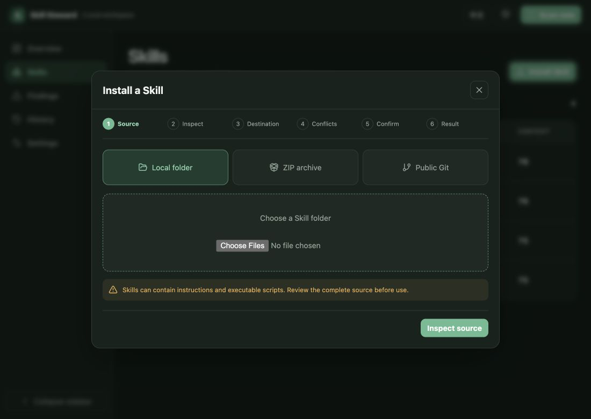

# Skill Steward

English | [简体中文](README.zh-CN.md)

Local-first portfolio health and safe installation for Agent Skills across Codex, Claude Code, GitHub Copilot, and the wider harness ecosystem.

> Status: active alpha. Install from source or a local tarball; the npm package is not published yet.

## Why Skill Steward

Agent Skills are easy to add and hard to govern. The same machine may contain shared Skills, harness-specific Skills, project copies, broken references, overlapping triggers, and bundles that silently consume far more context than expected.

Skill Steward gives that portfolio one control plane without becoming another agent harness:

- scans standard user and project Skill directories for 30 harnesses, plus shared locations such as `.agents/skills`;
- fingerprints complete Skill bundles and reports structural, reference, portability, size, and overlap risks deterministically—no LLM required;
- analyzes a concrete task and recommends an explainable minimal set of relevant Skills before work begins;
- presents an explainable Audit Cockpit with 16 configurable KPIs, Chinese/English copy, and system/light/dark appearance;
- inspects local folders, ZIP files, and public HTTPS Git repositories before installation;
- requires an explicit harness, scope, conflict decision, and final confirmation;
- applies atomic create/replace transactions with backups, provenance, and drift-guarded rollback;
- binds to loopback and sends no telemetry or Skill content to a hosted service.

## Screenshots




## Installation

### Requirements

- Node.js 22 or newer
- pnpm 10 or newer for source development

### Run from source

```bash
git clone https://github.com/CongBao/skill-steward.git
cd skill-steward
pnpm install --frozen-lockfile
pnpm check
pnpm build
node packages/cli/dist/main.js dashboard
```

SSH works too:

```bash
git clone git@github.com:CongBao/skill-steward.git
```

Use `--no-open` when you want to copy the printed loopback URL yourself:

```bash
node packages/cli/dist/main.js dashboard --no-open --port 4762
```

### Install a locally packed CLI

```bash
mkdir -p artifacts
pnpm --filter skill-steward pack --pack-destination artifacts
npm install --global ./artifacts/skill-steward-*.tgz
skill-steward dashboard
```

The npm package has not been published. Until it is, install from source or a locally packed tarball.

## Quick start

Launch the Audit Cockpit:

```bash
skill-steward dashboard
```

Or stay in the terminal:

```bash
skill-steward doctor --json
skill-steward discover --json
skill-steward scan
skill-steward preflight --task "Review this TypeScript change for security regressions"
skill-steward report --format markdown
skill-steward diff --format json
```

The dashboard opens on `127.0.0.1`, inventories standard user and project roots, and keeps reports in `~/.skill-steward`. Override the state directory without changing the Skill roots:

```bash
SKILL_STEWARD_HOME=/path/to/private/state skill-steward dashboard --no-open
```

## Task preflight

Task preflight answers a narrower question than the portfolio health score: which installed Skills add distinct value to the task in front of you?

Open **Preflight** in the dashboard, or run:

```bash
skill-steward preflight --task "Review this pull request for security regressions and missing tests"
skill-steward preflight --task-file ./task.txt --max-skills 3
printf '%s' "Review this pull request" | skill-steward preflight --stdin --json
```

Every run refreshes the local portfolio, ranks candidates using routing metadata, scope, existing findings, redundancy, and estimated context cost, then recommends at most five Skills. Each selected and excluded candidate includes machine-readable reasons. The deterministic baseline works offline and does not require an LLM.

The raw task text is never written to disk. Skill Steward stores only a task hash, aggregate counts, numeric candidate scores, selected Skill IDs, and optional feedback in the bounded local evidence file. The recommendation estimates relevance and context savings; it does not claim that a task will succeed.

## Supported harnesses

The catalog currently supports 30 harnesses: Amazon Q, Antigravity, Auggie, Bob, Claude Code, Cline, CodeBuddy, Codex, ForgeCode, Continue, CoStrict, Crush, Cursor, Factory, Gemini CLI, GitHub Copilot, iFlow, Junie, Kilo Code, Kimi, Kiro, Lingma, Vibe, OpenCode, Pi, Qoder, Qwen Code, RooCode, Trae, and Windsurf.

It also understands shared `.agents/skills`, Codex's shared user/project convention, Claude Code's personal/project roots, and GitHub Copilot's personal/project roots. Adding a future harness is a catalog adapter rather than a scanner rewrite.

## How safe installation works

The Skills page follows six visible stages:

1. **Source** — choose a local folder, ZIP archive, or public HTTPS Git repository with optional ref and subdirectory.
2. **Inspect** — review candidates, file counts, estimated context, scripts, executable files, fingerprint, references, and findings.
3. **Destination** — choose one harness and global or explicit project scope.
4. **Conflicts** — identical content is a no-op; different content stops until you rename or explicitly choose backed-up replacement.
5. **Confirm** — see the exact destination and filesystem operations, then acknowledge the review.
6. **Result** — receive a transaction ID, refreshed scan, installation history, and rollback availability.

ZIP traversal, absolute paths, links, case-folding collisions, excessive entries, and expansion limits are rejected. Public Git staging is non-interactive, disables hooks and submodules, records the resolved commit, and never executes repository content. Rollback refuses to overwrite a destination that changed after installation.

## Comparison

Based on official documentation reviewed on 2026-07-02:

| Product | Primary documented focus | Skill sources and scope | Cross-harness portfolio audit | Transactional local replacement/rollback |
|---|---|---|---|---|
| **Skill Steward** | Local inventory, explainable hygiene signals, reviewed installation | Folder, ZIP, public Git; 30-tool catalog; global/project | **Yes** | **Yes** |
| [Codex Agent Skills](https://developers.openai.com/codex/skills) | Discovering and using Skills in Codex, including repository/user/admin/plugin locations | Codex locations and Skill/plugin distribution | Codex scope only | No cross-harness journal |
| [Claude Code Agent Skills](https://code.claude.com/docs/en/skills) | Discovering and using project, personal, and plugin Skills in Claude Code | Project, personal, plugin, and enterprise precedence | Claude Code scope only | No cross-harness journal |
| [GitHub Copilot Agent Skills](https://docs.github.com/en/copilot/how-tos/use-copilot-agents/cloud-agent/add-skills) | Using Skills with Copilot and `gh skill` search/preview/install/update flows | Repository and personal scopes with source/ref provenance | Multiple compatible roots, but not a general portfolio health dashboard | `gh skill` manages its install/update workflow; Skill Steward adds filesystem backup and rollback across catalog targets |

Skill Steward combines cross-harness discovery, deterministic audit, context-cost visibility, reviewed installation, and rollback. The selected harness still executes the Skill.

## Privacy and security

- The Web server binds to `127.0.0.1` by default and rejects unexpected Host and Origin values.
- UI assets and APIs are same-origin; the packaged UI loads no remote fonts, scripts, images, or analytics.
- Mutations require a random per-process token held by the local page.
- Complete Skill bodies are not returned by dashboard read APIs.
- Task preflight keeps task text in process memory; persisted evidence excludes task text and extracted terms.
- Installation-source scripts, hooks, submodules, package managers, and build commands are never executed.
- Every source and destination fingerprint is revalidated immediately before commit or rollback.

Review [SECURITY.md](SECURITY.md) before reporting a vulnerability. The detailed package and trust-boundary design is in [docs/architecture.md](docs/architecture.md).

## Current limitations

- The public Git adapter accepts credential-free HTTPS repositories only; private credentials and SSH are intentionally out of scope for the first release.
- Marketplace and registry sources are future adapters.
- Health measures deterministic portfolio hygiene; runtime task success is outside that score.
- Task preflight uses deterministic lexical routing signals and does not yet observe actual Harness invocation outcomes.
- Finding explanations are currently emitted by the engine in English; complete finding localization is planned.

## Roadmap

1. Harden the local audit and installation foundation with more adversarial fixtures and signed release artifacts.
2. Add safe disable, quarantine, scope migration, uninstall, and restore actions around reviewed recommendations.
3. Add invocation-time preflight adapters and learn from task outcomes while keeping raw Skill and conversation content local.
4. Add optional registries, update checks, policies, team baselines, and supply-chain attestations behind explicit adapters.

See [CHANGELOG.md](CHANGELOG.md) for released behavior.

## Contributing

Read [CONTRIBUTING.md](CONTRIBUTING.md), [CODE_OF_CONDUCT.md](CODE_OF_CONDUCT.md), and [GOVERNANCE.md](GOVERNANCE.md). For help use [SUPPORT.md](SUPPORT.md); for vulnerabilities use [SECURITY.md](SECURITY.md). The project is available under the [MIT License](LICENSE).
