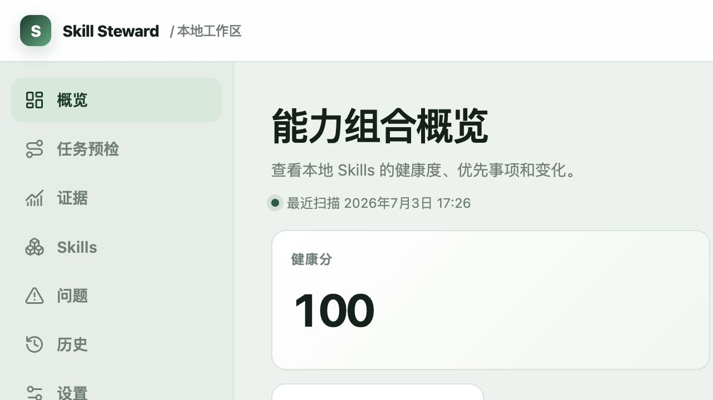
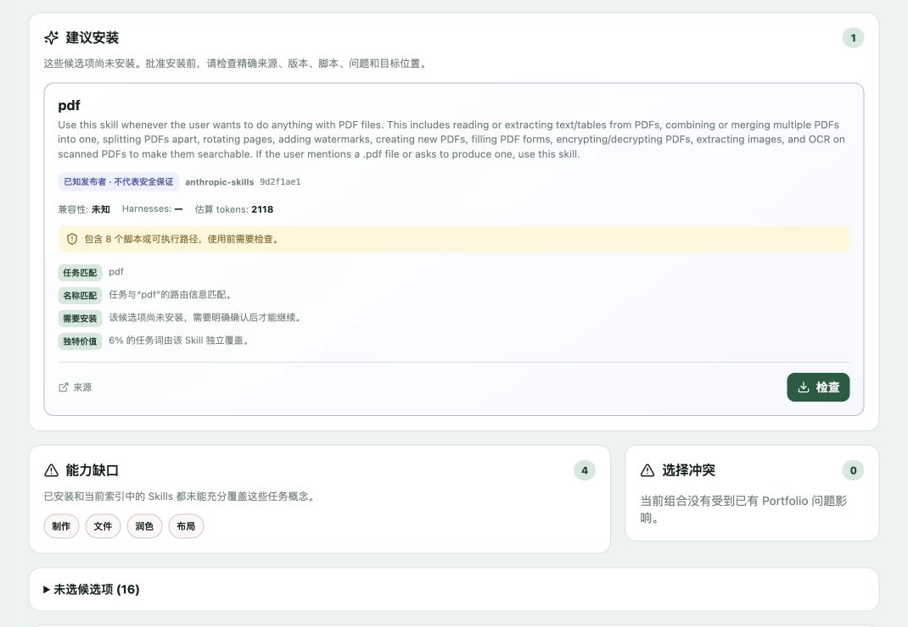
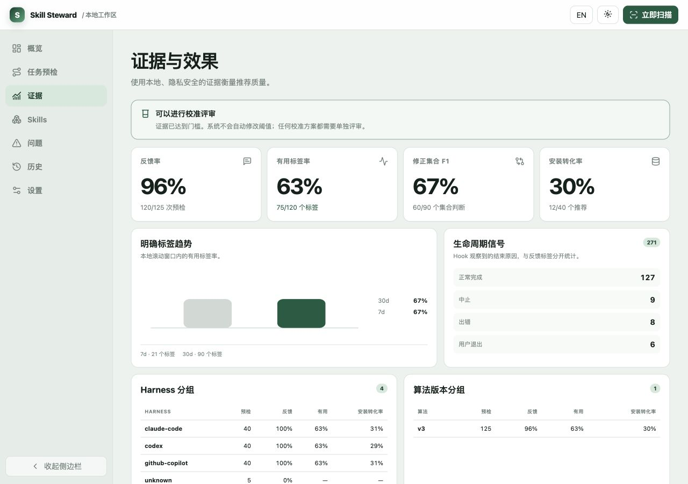
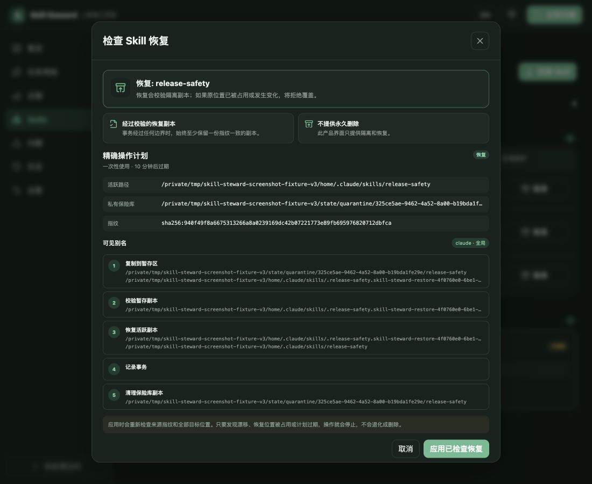
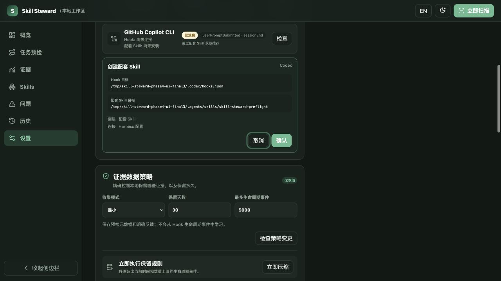

# Skill Steward

[English](README.md) | 简体中文

先看清、再选择、最后安全地调整你的 Agent Skills。

Skill Steward 是一款跨 Harness 的 Agent Skills 本地助手与控制台。Codex、Claude Code 和 GitHub Copilot CLI 三个核心适配器共用一套带证据的清单和修改协议；其他 Harness 目前只按目录约定盘点，不宣称已经核验原生行为。

它不是另一款 Harness：不回答提示词、不调度模型，也不运行 Agent。任务仍由你原本的 Harness 执行；Skill Steward 负责帮它选出少而相关的 Skills，并让每次改动都能先检查、再执行、必要时撤回。

> 当前状态：活跃 Alpha。现在可以从源码或本地 tarball 安装；npm 包尚未发布。

## 它主要做三件事

### 1. 看懂手上的 Skill 资产

扫描 30 种 Harness 的常见用户级与项目级目录，检查完整 Skill 内容包，并把重复内容、失效引用、上下文过大、脚本、可执行文件、可移植性和作用域重叠集中到一个本地 Dashboard 中。

### 2. 开工前做一次任务预检

把当前任务同时与已安装 Skills、以及你主动启用的公共目录候选项比较。受限的中英文能力模型会区分偶然词语重叠与“动作—对象”意图，再选出真正补充不同能力的最小集合。结果分为**立即使用**、**建议安装**、**能力缺口**和**未选候选项**。尚未安装的 Skill 可以进入视野，但不会因此被当作已经可信。

### 3. 只执行看过、能撤回的修改

安装前先检查来源版本和具体文件操作。确认后才写入，并记录来源、备份和漂移状态，必要时可以回滚。隔离与恢复能让 Skill 暂时退出使用，而不是直接永久删除。

### 为什么值得一直开着

- **不用切换到另一个工具：** Codex 和 Claude Code 可以在提示词 Hook 中直接运行预检。Copilot Hook 只观察生命周期，推荐通过配套 Skill 或 CLI 获取。
- **跨工具看同一份清单：** 直接安装和插件管理的 Skills 会进入一套带证据的可见性模型，而不是看见目录就算可用。
- **本地修改有退路：** 安装、接入、多 Harness 断开、最终卸载、隔离、恢复和回滚都基于已经检查过的精确计划，遇到漂移立即停止。
- **中断后可以继续处理：** 托管集成如果在途中停止，CLI、本地 API 和 Dashboard 会根据同一份本地证据推导出唯一安全的撤回或收尾方向，供用户检查确认；不能自行改选方向，也没有强制写入。

排序过程在本机确定性运行，不依赖 LLM。最终是否使用推荐项、以及如何执行任务，仍由你正在使用的 Harness 决定。

## 原生盘点可见性

找到目录，并不代表 Harness 就能使用其中的 Skill。核心原生盘点适配器会检查 Codex、Claude Code 和 GitHub Copilot CLI 文档所定义的本地直接 Skill 目录和插件内 Skill 入口，报告与界面再分别展示三类状态：

- **来源状态：** `scanned`、`missing`、`unreadable`、`invalid`、`disabled`、`stale`、`ambiguous`、`truncated`
- **Harness 覆盖状态：** `verified`、`partial`、`unavailable`、`convention-only`
- **Skill 可见状态：** `effective`、`shadowed`、`inactive`、`ambiguous`

缺少本地运行时或 MDM 证据时，Copilot 的 Harness 覆盖状态可能是 `partial`。本地文件无法证明启用状态或优先级时，相关来源或 Skill 可见状态可能是 `ambiguous`。

由原生插件管理的 Skills 在 Skill Steward 治理中只读；用户应通过所属 Harness 管理它们。隔离与恢复只适用于 Skill Steward 直接管理的 Skills。在总计 30 种 Harness 中，三种核心适配器之外的覆盖仅提供基于目录约定的盘点和安装，Harness 覆盖状态为 `convention-only`，并未验证原生语义。

扫描结果只是当前工作区及用户级作用域的快照，不会遍历本机上的每个项目或工作区。

## 界面截图

这些界面使用本地示例数据展示完整状态；其中的分数和证据数量并不是项目自身的使用结果。











本页截图均切换到中文界面；第三方 Skill 的名称和说明保留来源语言。[英文 README](README.md) 使用对应的英文版本。

## 安装

### 环境要求

- Node.js 22 或更高版本
- 构建本地安装包时需要 pnpm 10 或更高版本

### 安装经过校验的本地 CLI 包

在 npm 包正式发布前，先生成并安装仓库测试过的同一份 tarball。后面的首次体验全程使用全局 `skill-steward` 命令，不会在源码入口和安装后的命令之间来回切换。

```bash
git clone https://github.com/CongBao/skill-steward.git
cd skill-steward
pnpm install --frozen-lockfile
package_dir="$(mktemp -d)"
pnpm --filter skill-steward pack --pack-destination "$package_dir"
npm install --global "$package_dir"/skill-steward-*.tgz
skill-steward --version
```

也可以使用 SSH：

```bash
git clone git@github.com:CongBao/skill-steward.git
```

如果电脑上已有较旧的全局版本，测试仓库新改动前要重新打包并安装。可以用 `skill-steward --version` 确认当前实际调用的版本。

源码开发环境和完整的贡献者质量检查见[贡献指南](CONTRIBUTING.md)。

CLI 包中会带上专用的 `README.md`、MIT `LICENSE`、自动生成的 `THIRD_PARTY_NOTICES.txt` 和机器可读的第三方依赖清单。校验程序会同时检查 npm 和 pnpm 生成的真实 tarball，并拿包内文件与可信构建目录、仓库锁定的 `runtime-audit.json` 对照；普通构建只验证这份审计记录，不会悄悄改写它。

## 第一次使用

最短的体验路径只有三步：扫描一次、拿一个真实任务做预检、再打开 Dashboard 查看全貌。

```bash
skill-steward scan
skill-steward preflight \
  --task "检查这次 TypeScript 变更的安全回归和缺失测试" \
  --harness codex
skill-steward dashboard
```

可安装的候选 Skill 一定会显示自己的 Candidate ID。这个示例明确给出了受支持的 Harness，因此还会得到一条完整、可复制的审阅预览命令。目录没有声明安装范围（scope）时，命令会使用 `--scope project`，CLI 会把未填写的工作区解析为当前目录；它不会猜测 Harness，也不会擅自扩大到全局安装。

这三步不会修改任何 Skill 或 Harness 配置，但会把最新本地报告和经过隐私裁剪的预检证据写入 `~/.skill-steward`；原始任务文本不会保存。安装预览只生成待审计划，不会直接安装。确认内容无误后，仍要另行执行它输出的 `--plan <id> --confirm` 完整命令。接入 Harness、改策略和治理操作也遵循同样的先预览、后确认流程。

如果只需要命令行清单和报告：

```bash
skill-steward doctor --json
skill-steward discover --json
skill-steward report --format markdown
```

状态默认保存在 `~/.skill-steward`。可以单独修改状态目录，不影响 Skill 扫描位置：

```bash
SKILL_STEWARD_HOME=/path/to/private/state skill-steward dashboard --no-open
```

## 任务预检

任务预检会在开工前回答两个问题：

1. 哪些已安装 Skills 对当前任务有独特价值？
2. 哪些尚未安装的 Skills 可能补上明确缺口？

```bash
skill-steward preflight --task-file ./task.txt --max-skills 3
printf '%s' "检查这个 Pull Request" | skill-steward preflight --stdin --compact-json
skill-steward preflight --task "检查这个 Pull Request" --installed-only
```

算法 v9 在本机确定性运行，不依赖 LLM，也不是通用语义搜索。它把词法相关性与版本化的中英文开发工作流语法结合起来，识别受限的动作、对象与局部动作—对象组合；选择时奖励尚未覆盖的能力，降低重复候选项优先级，并保留风险、Harness 可用性和上下文成本约束。明确否定的能力不会进入选择，“Skill”“代码”“Agent”等宽泛名词也不能单独触发候选项。能力缺口只有在证据足够具体、可以作为合理的 Skill 搜索提示时才显示。公开的 28 个合成场景基准达到 96.3% 精确率、92.9% 召回率、92.9% 精确集合命中率、92.9% 中英文决策一致率，4 个负例没有误报。可用 `pnpm test:preflight-quality` 复现；这些数字只描述仓库内公开语料，不代表任意任务或真实任务成功率。精确边界见[架构说明](docs/architecture.md#task-time-data-flow)与[测试协议](docs/alpha-testing.md#compact-and-bilingual-preflight)。

需要把结果交给 Harness 或配套 Skill 时，使用 `--compact-json`。compact 格式 v4 输出单行且不超过 4,096 UTF-8 字节，只保留选中的使用/安装建议与稳定警告码，不包含原始任务或能力明细；证据未能保存时，反馈命令为 `null`。`--json` 返回完整的 `PreflightResult`；完整结果 schema v5 增加能力覆盖、能力精度和触发置信度，并继续返回候选决策、评分、原因、冲突、盘点警告、能力缺口和汇总覆盖率。可安装的目录候选项仍可带有自身的 `source` 元数据，但不包含原生盘点的来源、所有权、插件或可见状态记录。资产报告与 Dashboard 会保留这些记录；Preflight 使用已经解析好的可见状态，并通过候选原因码和盘点警告表达相关结果。配套 Hook 仍以 2,048 字节为上限。

如果私有状态目录可以读取，但当前 Harness 沙箱不允许写入，Preflight 仍会以退出码 0 返回推荐，同时给出 `PREFLIGHT_PERSISTENCE_UNAVAILABLE`。警告不会暴露失败路径，并会明确说明本次报告和证据没有保存，因此不能为这次运行补录反馈。

CLI 的普通输出会给出本次预检 ID；只有成功保存的运行才会同时给出可直接执行的反馈命令。完整候选项和机器可读原因仍可通过 `--json` 查看。

```bash
skill-steward evidence feedback --preflight <run-id> --label useful
skill-steward evidence feedback \
  --preflight <run-id> \
  --label incomplete \
  --candidate <complete-correct-candidate-set>
```

使用 `incomplete` 时，`--candidate` 需要给出本次预检应当推荐的完整集合；原推荐中正确的候选项也要一并列出。这样修正指标才不会被误读。

原始任务文本不会写入磁盘。持久化证据只保留白名单内的哈希、ID、汇总数量、数值评分、来源 ID 和可选反馈。

### 主动启用的发现来源

内置来源默认全部停用：

- [OpenAI Plugins](https://github.com/openai/plugins)，索引公共插件包内的 Skills；
- [Anthropic Skills](https://github.com/anthropics/skills)；
- [Awesome GitHub Copilot](https://github.com/github/awesome-copilot)，标记为社区来源。

需要明确启用并刷新：

```bash
skill-steward catalog enable openai-plugins
skill-steward catalog refresh
skill-steward catalog list --json
```

自定义来源必须是不含凭据的公共 HTTPS Git 仓库，添加后仍保持停用。只有目录刷新会访问网络；Hook 和任务预检都读取已经校验的本地缓存，任务提交时不访问网络。“已知发布者”只说明仓库归属，不代表内容安全。

## 证据与数据策略

**最小模式是默认模式**。它保留经过隐私缩减的预检元数据，以及 `useful`、`incomplete`、`incorrect` 三类明确反馈，但不保存生命周期关联键或排序特征快照。

学习模式需要主动开启。它会额外保存有数量上限的数值特征快照，包括能力覆盖率、能力精度和触发置信度，以及使用 HMAC-SHA256 匿名键的无正文 Hook 事件；提取出的能力名称与动作—对象组合不会落盘。每次安装生成的私有盐值以 `0600` 权限保存，不会出现在导出、API 响应或 Dashboard 中。提示词、提取词、工作目录、原始会话/轮次 ID、转录、助手消息、工具参数和工具输出都不会保存。

```bash
skill-steward evidence policy --json
skill-steward evidence policy set --mode learning --retention-days 30 --max-events 5000
skill-steward evidence policy set --plan <id> --confirm
skill-steward evidence summary --json
skill-steward evidence export --output ./skill-steward-evidence.json
skill-steward evidence compact
skill-steward evidence erase
skill-steward evidence erase --plan <id> --confirm
```

不带 `--confirm` 的命令只负责生成一份准确、会过期的计划。真正执行时必须使用输出中的 `--plan <id> --confirm`；即使换到另一个进程，读取的仍是刚才看过的内容，而不是根据参数重新生成一份。计划一旦进入执行阶段就只能使用一次；如果随后发现漂移或执行失败，需要重新预览。保留时间可设为 7 到 365 天，生命周期事件上限可设为 100 到 10,000 条。

证据看板会同时展示反馈率、有用/不完整/不正确标签、修正集合精确率/召回率/F1，以及只按明确来源记录计算的安装转化率；每个比例都包含分子与分母。生命周期原因与明确标签分开显示，并可按 Harness、算法版本和 7/30 天滚动窗口比较。**生命周期结束不等于任务成功**。校准评审至少需要 **100 次带标签的预检**、30 个修正后的候选集合和 20 个不同的组合指纹。系统**不会自动修改任何排序阈值或权重**；未来校准必须单独评审和发布。

## Harness 集成

Skill Steward 可以接入 Codex、Claude Code 和 GitHub Copilot CLI，而不取代它们。托管 Hook 负责观察原生生命周期，共享配套 Skill 则让 Harness 能显式调用任务预检。JSON v3 状态会分别给出两部分的目标、原因、可用性和配套 Skill 的证据类别；临时保留的 Alpha 顶层兼容字段已经移除，调用方直接读取 `hook` 和 `companion`。因此 Hook 已连接时，缺失、过期、被修改或无法读取的配套 Skill 不会被掩盖：

```bash
skill-steward integrate status --json
skill-steward integrate plan --harness codex
skill-steward integrate plan --harness claude-code
skill-steward integrate plan --harness github-copilot
```

预览结果会保存 Hook 变更、配套 Skill 文件树、包内来源、所有权证据、记录头和 consumer 集合。执行时只接受输出中的一次性计划，并在同一把跨进程锁内重新检查所有字段；配套 Skill、Harness 配置、就绪报告和历史记录作为一个事务发布。最终确认前能够明确判定的失败会恢复原状态；如果发布结果不确定、修改锁丢失或补偿失败，系统会保留恢复证据并返回 `recovery-required`，不会猜测磁盘状态。

```bash
skill-steward integrate apply --plan <plan-id> --confirm
skill-steward integrate remove --harness codex
skill-steward integrate remove --plan <plan-id> --confirm
```

三种适配器共用一个配套 Skill 和一把修改锁，因此中断恢复是全局状态。查询状态不会修改文件；确认存在可恢复事务后，系统会先生成一次性方案。方案中的 `rollback` 或 `finalize` 方向由准确的事务和生命周期记录推导，用户只能检查并确认，不能改选。证据不明确时只提供诊断，不显示恢复按钮。

```bash
skill-steward integrate recovery status --json
skill-steward integrate recovery plan
skill-steward integrate recovery apply --plan <plan-id> --confirm
```

在受支持的 POSIX 平台上，恢复流程覆盖中断的新建、升级、连接、保留配套 Skill 的断开，以及最后一个使用方卸载。执行前会在同一把锁内重新核对记录、事务序号、文件证据、平台和方案有效期；恢复只完成一部分时会继续阻止其他变更，并要求生成新方案，不会误报成功。Windows CI 会验证原生记录身份、junction 拒绝、Win32 文件模式和保守规划，但在原生 reparse 检测与基于句柄的相对路径修改能力完成前，仍不会开放生命周期或恢复写入。

断开连接时，Skill Steward 会移除已经检查过的 Harness Hook，并同步更新有证据支持的使用方名单。只要还有其他 Harness 在使用，共享配套 Skill 就会原样保留；最后一个使用方断开时，只删除与安装记录完全一致的文件树。内容被修改、无法读取或缺少证明时，文件会留在原处等待人工检查。卸载依据安装时记录的指纹，而不是当前软件包，因此升级 Skill Steward 后，仍能安全移除没有被改动的旧版配套 Skill。新建、升级和最终卸载都依赖当前平台对应的无覆盖原生辅助包；缺包或不支持时直接阻止写入，不会退回存在竞态的文件操作。

托管 Hook 只读取本地缓存，出错时不阻断 Harness。Codex 和 Claude Code 适配器覆盖 `UserPromptSubmit` 与结束 Hook，两者只接收精简推荐，不包含原始任务文本或目录 URL；Codex 仍可能要求原生信任确认。GitHub Copilot CLI 明确保持仅观察：其文档化 Hook 记录生命周期证据，推荐则通过配套 Skill 或显式 CLI 预检获取。

## Harness 能力矩阵

| Harness | 托管事件 | 推荐能力 | 本地证据 |
|---|---|---|---|
| Codex | `UserPromptSubmit`、`Stop` | 通过提示词 Hook 推荐 + 观察 | 轮次生命周期 |
| Claude Code | `UserPromptSubmit`、`Stop`、`SessionEnd` | 通过提示词 Hook 推荐 + 观察 | 轮次与会话生命周期 |
| GitHub Copilot CLI | `userPromptSubmitted`、`sessionEnd` | **仅观察**；通过配套 Skill/CLI 获取推荐 | 提示词提交记录与会话生命周期 |

三种适配器的配置都使用临时 HOME 目录测试，并保留无关配置。“仅观察”是 Copilot 适配器的明确边界，它不会把推荐注入提示词。

## 支持的 Harness

目录规则覆盖 30 种 Harness：Amazon Q、Antigravity、Auggie、Bob、Claude Code、Cline、CodeBuddy、Codex、ForgeCode、Continue、CoStrict、Crush、Cursor、Factory、Gemini CLI、GitHub Copilot、iFlow、Junie、Kilo Code、Kimi、Kiro、Lingma、Vibe、OpenCode、Pi、Qoder、Qwen Code、RooCode、Trae 和 Windsurf。

在总计 30 种 Harness 中，三种核心适配器之外的覆盖只提供基于目录约定的盘点和安装。原生工作流集成范围更窄，以上方能力矩阵为准。

## 安全安装如何工作

Skill Steward 绝不会自动安装推荐项。目录候选项与手动提供的文件夹、ZIP 或公共 Git 来源一样，都要经过以下流程：

1. **检查来源**——解析记录的 commit，重新核对指纹、文件、脚本、可执行项、引用和问题。
2. **选择目标**——指定 Harness、全局/项目作用域、工作区和目标名称。
3. **处理冲突**——相同内容不重复写入；不同内容必须改名或明确替换。
4. **确认计划**——查看具体文件操作后再确认。
5. **执行写入**——原子创建或替换，记录来源并重新扫描。
6. **必要时回滚**——只有目标未漂移时才恢复备份。

安装目录候选项时，先预览，再照着输出中的命令执行：

```bash
skill-steward install --catalog-candidate <candidate-id> --harness codex --scope global
skill-steward install --plan <id> --confirm
```

预览完成后，经过检查的来源会暂存在私有状态目录，直到计划执行或过期。稍后在另一个进程中应用时，系统直接使用这份暂存内容，并再次核对来源和目标指纹；不会绕过已审核计划重新联网拉取。

安装、回滚和 Harness 集成共用同一把状态级跨进程锁。CLI 会先取得锁，再使用已经审核的计划；准备好校验后的副本后，还会再检查一次目标。多个替换操作同时到来时会依次执行，后进入的旧计划会因漂移而停止，不会覆盖刚完成的安装，也不会留下指向错误备份的记录。

ZIP 中的路径穿越、绝对路径、链接、大小写折叠冲突、过多条目和异常膨胀会被拒绝。Git 暂存使用非交互模式，禁用仓库 Hook 和 submodule，也不会执行来源内容。

## 可恢复治理

隔离可以让已安装 Skill 退出活跃发现，而不永久删除。系统会先创建私有副本并校验，再通过相邻回滚位置原子移动原目录、提交保险库副本并记录事务。恢复时会再次校验；原位置已被占用、计划过期，或来源/目标发生漂移时都会停止。

```bash
skill-steward govern history --json
skill-steward govern quarantine --skill <skill-id>
skill-steward govern quarantine --plan <id> --confirm
skill-steward govern restore --transaction <quarantine-id>
skill-steward govern restore --plan <id> --confirm
```

Dashboard 展示同一份操作计划，且没有“删除”操作。如果事务在复制、校验、移动、保险库、日志或恢复任一阶段失败，恢复逻辑会至少保留一份经过校验的副本。

## 竞品比较

Skill Steward 更适合同时使用多个 Harness、希望按当前任务选择 Skills，并看重本地可恢复操作的开发者。单一 Harness 内的原生体验仍由对应产品做得更完整；包管理器和 Registry 则更擅长大规模分发、依赖锁定或托管评测。下表于 **2026-07-05** 按链接中的产品文档核对。

| 产品 | 主要用途 | 任务开始时如何选择 | 跨 Harness 生命周期 |
|---|---|---|---|
| **Skill Steward** | 带证据的本地清单、任务预检、隐私裁剪证据和可恢复治理 | **针对当前任务统一比较已安装项与主动启用的目录候选项** | **三个核心适配器共用 Hook + 配套 Skill 评审事务、精确最终卸载，以及 CLI/API/Dashboard 一致的证据推导恢复；其他 Harness 只做目录约定盘点** |
| [Microsoft APM](https://microsoft.github.io/apm/) | 使用 manifest、lockfile、传递依赖、策略和 CI 审计管理 Agent 上下文包 | 安装并编译已经声明的依赖；审计完整性和部署漂移 | 向多个 Harness 部署不同类型的 Agent 配置，并用 lockfile 与策略保证可复现性 |
| [skills.sh](https://www.skills.sh/docs) | 公共目录、排行榜、安全检查和跨 Agent 一键安装 | 安装前按搜索与热度发现 Skills | 通过 CLI 把 GitHub Skills 安装或更新到支持的 Agent |
| [Tessl](https://docs.tessl.io/) | Skill 的版本化 Registry、评测、分发与优化 | 安装前搜索 Registry，并参考质量和效果评测 | 提供面向多种 Agent 的安装与托管评测流程 |
| [Codex Skills 与 Plugins](https://developers.openai.com/codex/plugins) | Codex 原生 Skills、Plugins、Marketplace 与 Hook | 在 Codex 内原生发现和调用 | Codex 原生启用、停用与卸载 |
| [Claude Code Skills 与 Plugins](https://code.claude.com/docs/en/discover-plugins) | Claude Code 原生 Skills、Plugins、Marketplace 与 Hook | 在 Claude Code 内原生发现和调用 | Claude Code 原生安装、更新、启停与移除 |
| [GitHub Copilot Agent Skills](https://docs.github.com/en/copilot/concepts/agents/about-agent-skills) | Copilot 支持界面中的原生 Skills 与 Hook | 在 Copilot 内原生发现和调用 | Copilot 原生 Skill 与 Hook 管理 |

## 隐私与安全

- 服务只监听 `127.0.0.1`，并拒绝不符合预期的 Host 和 Origin。
- 打包 UI 使用同源资源，不加载远程字体、脚本、图片或分析服务。
- 修改操作需要当前进程生成并注入页面的随机令牌。
- Dashboard 读取接口不会返回完整 Skill 正文。
- 提示词提交时只使用缓存状态，不联系目录来源。
- 最小证据模式默认启用；学习模式需要先检查策略变更。
- 持久化证据不包含任务文本、提取词、描述、原因、URL、本地路径、转录、助手内容、工具数据或原始 Harness ID。
- 净化导出和 API 响应不会包含私有 HMAC 盐值。
- 不执行安装来源中的脚本、包管理器、构建命令、仓库 Hook 或 submodule。
- CLI 的安装、集成应用、证据策略、证据清除、隔离和恢复计划保存在私有目录、会过期且只能使用一次；确认命令不会根据原始参数临时重建计划。
- 安装、Harness 接入和断开共用跨进程锁。接入事务把无覆盖原生文件操作、恢复状态、就绪报告、Hook 配置、历史记录与回滚绑定到同一份已检查计划。
- npm 和 pnpm 的打包结果都会与完整文件树、第三方声明和锁定的运行时审计记录核对。
- 治理只提供经过校验的隔离/恢复，不提供永久删除，并在漂移时停止。

安全问题请按照 [SECURITY.md](SECURITY.md) 说明提交。包结构与信任边界详见 [docs/architecture.md](docs/architecture.md)。

## 当前限制

- 任务评分仍是确定且有边界的。算法 v9 增加了公开的中英文开发工作流能力语法与基准，但不等于通用语义理解，也不衡量真实任务成败。
- 证据描述推荐和生命周期事件，不证明任务成功，也不会自动修改排序。
- Harness 生命周期应用目前只覆盖 Codex、Claude Code 和 GitHub Copilot CLI。最终卸载只在可验证的 POSIX 路径上开放；Windows 版本在具备原生 reparse 与文件身份校验前仍会阻止生命周期写入。
- GitHub Copilot CLI 仅观察，不支持自动提示词推荐注入。
- 原生盘点只覆盖 Codex、Claude Code 和 GitHub Copilot CLI 文档所定义的本地入口。缺少本地运行时或 MDM 证明时，Copilot 的 Harness 覆盖状态可能为 `partial`；相关来源或 Skill 可见状态可能为 `ambiguous`。
- 每次扫描只覆盖当前工作区和用户作用域，不会遍历机器上的全部项目或工作区。
- 在总计 30 种 Harness 中，三种核心适配器之外的覆盖仍按目录约定处理；能扫描某个 Harness，不代表已经验证其原生插件或 Hook 语义。
- 原生插件管理的 Skills 只读；请通过所属 Harness 管理。Skill Steward 的隔离与恢复只处理直接管理的 Skills。
- 计划进入执行阶段后即视为已使用；后续即使因为漂移而停止，也要重新生成计划再试。
- Skill Steward 会拦截已检测到的路径异常和文件漂移，但无法隔离同一操作系统用户权限下运行的恶意进程。
- 目录刷新只支持不含凭据的公共 HTTPS Git 来源，不支持私有仓库或 SSH。
- 目录记录是元数据快照，不是安全背书；生成安装计划前始终重新检查来源。
- Dashboard 使用中文时，底层问题说明仍然是英文。

## 路线图

1. 只在本地优先级、启用状态、生命周期与信任行为都可测试时，验证更多原生适配器。
2. 达到公开证据门槛后，再评估经过评审的排序校准。
3. 在可恢复治理日志之上增加作用域迁移和更广的策略基线。
4. 增加签名发布产物和供应链证明。

版本变化见 [CHANGELOG.md](CHANGELOG.md)；历史 Alpha.3 结论、真实操作证据、基线和优先级见 [2026-07-03 产品评审](docs/product-review-2026-07-03.md)。

## 参与贡献

贡献前请阅读 [CONTRIBUTING.md](CONTRIBUTING.md)、[CODE_OF_CONDUCT.md](CODE_OF_CONDUCT.md) 和 [GOVERNANCE.md](GOVERNANCE.md)。一般问题请参考 [SUPPORT.md](SUPPORT.md)，安全问题请使用 [SECURITY.md](SECURITY.md) 中的私密渠道。项目采用 [MIT License](LICENSE)。
