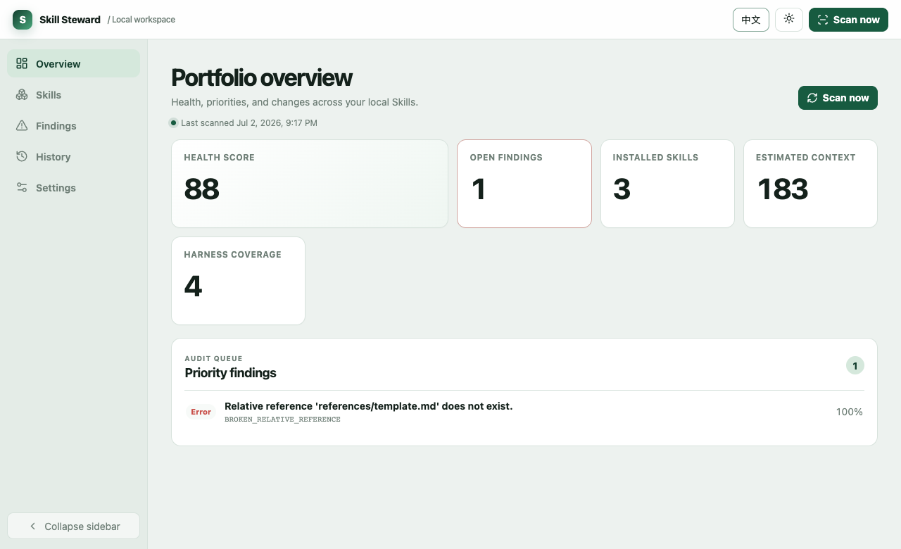
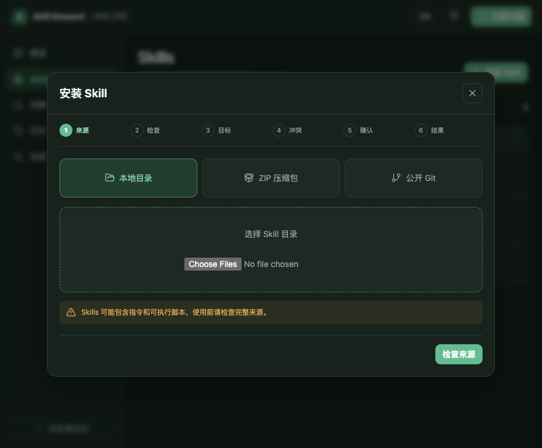

# Skill Steward

[English](README.md) | 简体中文

面向 Codex、Claude Code、GitHub Copilot 等 Harness 的本地优先 Agent Skills 资产健康与安全安装工具。

> 当前状态：活跃 Alpha。现在可以从源码或本地 tarball 安装；npm 包尚未发布。

## 为什么选择 Skill Steward

Agent Skill 装起来很快，长期维护却很容易失控。同一台机器上可能同时存在共享 Skill、特定 Harness 的 Skill、项目副本、失效引用、触发范围重叠，以及占用大量上下文的内容包。

Skill Steward 为这些本地 Skill 提供统一的管理视图，同时保持独立于执行任务的 Harness：

- 扫描 30 种 Harness 的标准用户级和项目级 Skill 目录，并覆盖 `.agents/skills` 等共享位置；
- 对完整 Skill 目录生成指纹，确定性检查结构、引用、可移植性、体积和触发重叠，不依赖 LLM；
- 提供可解释的 Audit Cockpit，内置 16 项可配置 KPI、中英双语以及跟随系统/浅色/深色外观；
- 安装前检查本地文件夹、ZIP 文件和公开 HTTPS Git 仓库；
- 明确选择 Harness、作用域和冲突处理方式，确认后才写入文件；
- 通过原子创建或替换、自动备份、来源记录和漂移保护完成安装与回滚；
- 只监听回环地址，不上传遥测数据或 Skill 内容。

## 界面截图





## 安装

### 环境要求

- Node.js 22 或更高版本
- 从源码开发时需要 pnpm 10 或更高版本

### 从源码运行

```bash
git clone https://github.com/CongBao/skill-steward.git
cd skill-steward
pnpm install --frozen-lockfile
pnpm check
pnpm build
node packages/cli/dist/main.js dashboard
```

也可以使用 SSH 克隆：

```bash
git clone git@github.com:CongBao/skill-steward.git
```

如果不希望自动打开浏览器，可以使用 `--no-open`，再自行打开终端中输出的回环地址：

```bash
node packages/cli/dist/main.js dashboard --no-open --port 4762
```

### 安装本地打包的 CLI

```bash
mkdir -p artifacts
pnpm --filter skill-steward pack --pack-destination artifacts
npm install --global ./artifacts/skill-steward-*.tgz
skill-steward dashboard
```

npm 包尚未发布。在正式发布前，请从源码或本地 tarball 安装。

## 快速开始

启动 Audit Cockpit：

```bash
skill-steward dashboard
```

也可以只使用终端命令：

```bash
skill-steward doctor --json
skill-steward discover --json
skill-steward scan
skill-steward report --format markdown
skill-steward diff --format json
```

Dashboard 监听 `127.0.0.1`，扫描标准用户目录和项目目录，并将报告保存在 `~/.skill-steward`。可以单独修改状态目录，不影响 Skill 扫描位置：

```bash
SKILL_STEWARD_HOME=/path/to/private/state skill-steward dashboard --no-open
```

## 支持的 Harness

目前支持 30 种 Harness：Amazon Q、Antigravity、Auggie、Bob、Claude Code、Cline、CodeBuddy、Codex、ForgeCode、Continue、CoStrict、Crush、Cursor、Factory、Gemini CLI、GitHub Copilot、iFlow、Junie、Kilo Code、Kimi、Kiro、Lingma、Vibe、OpenCode、Pi、Qoder、Qwen Code、RooCode、Trae 和 Windsurf。

Skill Steward 还支持共享 `.agents/skills`、Codex 的用户级和项目级目录、Claude Code 的个人和项目目录，以及 GitHub Copilot 的个人和项目目录。新增 Harness 只需增加目录适配器，不需要重写扫描器。

## 安全安装如何工作

Skills 页面将安装过程拆成六个可见阶段：

1. **来源**——选择本地文件夹、ZIP 文件或公开 HTTPS Git 仓库，可以指定 ref 和子目录。
2. **检查**——查看候选 Skill、文件数量、估算上下文、脚本、可执行文件、指纹、引用和检查结果。
3. **目标**——选择一个 Harness，以及全局或明确的项目作用域。
4. **冲突**——内容相同时不重复写入；内容不同时必须改名，或明确选择带备份的替换。
5. **确认**——核对目标路径和文件系统操作，再确认执行。
6. **结果**——获得事务 ID、刷新后的扫描结果、安装历史和可用的回滚操作。

ZIP 中的路径穿越、绝对路径、链接、大小写折叠冲突、过多条目和异常膨胀会被拒绝。Git 暂存过程采用非交互方式，禁用 hooks 和 submodules，记录解析后的 commit，且不执行仓库内容。安装后的目标一旦发生变化，回滚会停止，避免覆盖用户修改。

## 竞品比较

下表基于 2026-07-02 查阅的官方文档：

| 产品 | 官方定位 | Skill 来源与作用域 | 跨 Harness 资产检查 | 本地事务式替换与回滚 |
|---|---|---|---|---|
| **Skill Steward** | 本地清单、可解释的健康信号、经检查的安装 | 文件夹、ZIP、公开 Git；30 种工具；全局/项目 | **支持** | **支持** |
| [Codex Agent Skills](https://developers.openai.com/codex/skills) | 在 Codex 中发现和使用 Skill，覆盖仓库、用户、管理员和插件目录 | Codex 目录及 Skill/插件分发 | 仅覆盖 Codex 作用域 | 无跨 Harness 事务日志 |
| [Claude Code Agent Skills](https://code.claude.com/docs/en/skills) | 在 Claude Code 中发现和使用项目、个人及插件 Skill | 项目、个人、插件和企业级优先级 | 仅覆盖 Claude Code 作用域 | 无跨 Harness 事务日志 |
| [GitHub Copilot Agent Skills](https://docs.github.com/en/copilot/how-tos/use-copilot-agents/cloud-agent/add-skills) | 通过 Copilot 和 `gh skill` 搜索、预览、安装及更新 Skill | 仓库与个人作用域，保留 source/ref 来源信息 | 支持多个兼容目录，但不提供通用资产健康看板 | `gh skill` 管理自身安装与更新；Skill Steward 为目录目标补充文件系统备份和回滚 |

Skill Steward 将跨 Harness 发现、确定性检查、上下文成本可见性、安装前检查和回滚放在同一个本地工作流中；实际执行 Skill 的仍是用户选择的 Harness。

## 隐私与安全

- Web 服务默认只监听 `127.0.0.1`，并拒绝不符合预期的 Host 和 Origin。
- UI 资源和 API 使用同源地址；打包后的 UI 不加载远程字体、脚本、图片或分析服务。
- 修改操作需要当前进程随机生成并注入本地页面的令牌。
- Dashboard 的读取接口不会返回完整 Skill 正文。
- 不执行安装来源中的脚本、hooks、submodules、包管理器或构建命令。
- 提交安装或回滚前都会重新验证来源和目标指纹。

安全问题请按照 [SECURITY.md](SECURITY.md) 说明提交。包结构与信任边界详见 [docs/architecture.md](docs/architecture.md)。

## 当前限制

- Git 适配器只接受不含凭据的公开 HTTPS 仓库；首个版本不处理私有仓库凭据和 SSH 来源。
- Marketplace 和 Registry 来源将在后续通过适配器加入。
- 健康分衡量确定性的 Skill 资产卫生状况，不评价运行时任务能否成功完成。
- 引擎目前使用英文输出检查结果说明，完整本地化仍在计划中。

## 路线图

1. 通过更多对抗性测试样例和签名发布产物加固本地检查与安装基础。
2. 增加调用前预检适配器，同时保持与具体 Harness 解耦。
3. 在原始 Skill 与会话内容留在本机的前提下，利用用户标签和任务结果改进信号质量。
4. 通过显式适配器加入可选 Registry、更新检查、策略、团队基线和供应链证明。

版本变化见 [CHANGELOG.md](CHANGELOG.md)。

## 参与贡献

贡献前请阅读 [CONTRIBUTING.md](CONTRIBUTING.md)、[CODE_OF_CONDUCT.md](CODE_OF_CONDUCT.md) 和 [GOVERNANCE.md](GOVERNANCE.md)。一般问题请参考 [SUPPORT.md](SUPPORT.md)，安全问题请使用 [SECURITY.md](SECURITY.md) 中的私密渠道。项目采用 [MIT License](LICENSE)。
