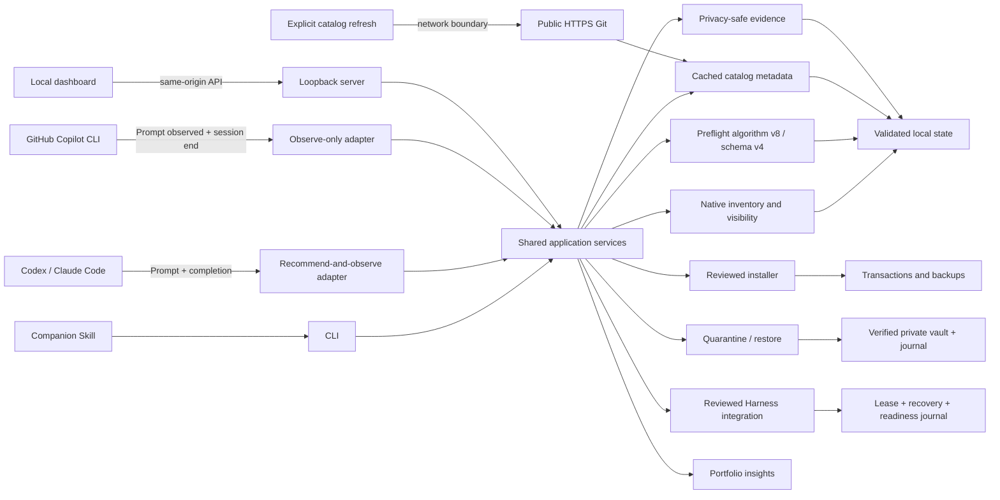

# Architecture

Skill Steward is a local-first TypeScript monorepo and companion for managing Agent Skills. It is not an agent Harness: Codex, Claude Code, GitHub Copilot, and other supported tools continue to execute tasks and Skills.

## Package boundaries

- `packages/engine` owns root discovery, parsing, fingerprints, findings, overlap analysis, the shared Harness root catalog, and core native inventory adapters for documented Codex, Claude Code, and GitHub Copilot CLI surfaces.
- `packages/insights` converts reports into deterministic health and KPI presentation models.
- `packages/catalog` defines source metadata, disabled presets, Git refresh, last-known-good behavior, candidate identity, and installation reinspection. It does not persist data itself.
- `packages/preflight` combines installed and cached catalog candidates, then applies relevance, coverage, risk, redundancy, compatibility, narrow English negative-routing clauses, and installation penalties. Algorithm v8 requires at least two shared positive task terms for non-name matches and owns a versioned trigger-rule table. Its first rule adds one bounded score only for positive `review ... before merge` task intent, the `request` + `code` + `review` Skill-name signature, and the same positive `before merge` routing phrase. Generic name terms and pairs split by any Unicode punctuation/symbol boundary cannot satisfy the rule. One internal polarity module recognizes bounded whole-word task negations (`do not`, straight/curly `don't`, `never`, `avoid`, `without`) and candidate action negations (use/invoke/call/run/apply). Semicolons, sentence punctuation, and line breaks end a clause; comma/colon lists stay negative, while `, but ...` or a colon followed by a bounded positive action opens an explicit contrast. Recognized negated task text contributes neither ordinary relevance, full-name matching, trigger evidence, nor capability gaps. The current rule uses `code` only as a conflict discriminator: negative code-review evidence remains a veto, while positive code review can coexist with a different negative review object. Capability-gap corroboration uses positive matched terms over the complete route-term denominator, so negative metadata cannot raise its relevance gate. The algorithm also deterministically canonicalizes a bounded set of Simplified/Traditional Chinese routing concepts and derives recommendation-neutral capability-gap hints through a separate display path. In that path, a name match must contribute a specific canonical concept; generic single-token names still need the normal specific multi-concept relevance evidence. Positive task aliases, positive candidate metadata, and selected positive coverage project into one canonical namespace. Shared routing does not recover low-confidence unsegmented two-character fragments. It remains lexical rather than general cross-language semantic understanding and has no filesystem or network I/O.
  A negative-name guard excludes a candidate when its full name is negated, or when at least two name terms have greater negative-clause overlap than positive-task overlap. This keeps workflow variants within the same rejected intent without treating a single generic term as a veto. An action word after a colon opens a positive contrast only when the suffix is not itself an action-name list joined by bounded `and`/`or` forms or Unicode punctuation/symbols, and not an optional-comma `instead of` list. A standalone `instead` not followed by `of` can mark the suffix as positive.
- `packages/evidence` defines strict content-free evidence, policy, lifecycle, metric, breakdown, and readiness schemas plus pure aggregation.
- `packages/integrations` defines compact Hook protocols, the shared capability matrix, proof-aware Codex/Claude/Copilot configuration plans, independent Hook/companion status, reviewed create/upgrade/no-op/disconnect operations, companion ownership proofs, and the recoverable integration coordinator.
- `packages/store` owns validated atomic reports, private reviewed-plan envelopes, catalog metadata, bounded history, labels, integration recovery/readiness/configuration journals, the shared portfolio mutation lease, privacy-reduced preflights, private HMAC salt, bounded lifecycle events, export, compaction, and erase.
  Fragment snapshot reads distinguish ordinary concurrent cleanup from replacement by immediately resampling a mismatched path: only proven absence becomes a bounded whole-snapshot retry; a still-present same-name path remains a fail-closed replacement.
- `packages/installer` owns persistent private source staging, ZIP/Git safeguards, inspection, destination plans, atomic transactions, journaling, and rollback.
- `packages/governance` owns exact quarantine/restore plans, verified vault transactions, failure recovery, and the append-only governance journal.
- `packages/dashboard-server` composes those packages behind a loopback security boundary and versioned API.
- `apps/dashboard` is a dashboard and configuration client. It does not contain a second analysis or mutation implementation. Presentation code resolves affected Skill names, treats an empty scanned portfolio as unscored, and formats KPI values from the current snapshot rather than example numbers.
- `packages/cli` exposes the same services headlessly and bundles the dashboard plus companion Skill. Its human Preflight output is bounded and readable; the explicit CLI feedback command writes labels through the existing evidence store.

## Native inventory and visibility

Finding a directory does not prove the Harness can use the Skill. The native inventory and visibility resolver plans documented local direct and plugin Skill sources for Codex, Claude Code, and GitHub Copilot CLI, then keeps three taxonomies separate:

- **Source statuses:** `scanned`, `missing`, `unreadable`, `invalid`, `disabled`, `stale`, `ambiguous`, `truncated`
- **Harness coverage:** `verified`, `partial`, `unavailable`, `convention-only`
- **Skill exposure:** `effective`, `shadowed`, `inactive`, `ambiguous`

Reports keep source status, Harness coverage, and Skill exposure records instead of treating every directory as an active Skill count. Copilot Harness coverage can be `partial` when local runtime or MDM evidence is incomplete. An affected source or Skill exposure can be `ambiguous` when local files do not prove activation or precedence.

Native plugin-managed Skills are read-only to Skill Steward governance and remain the owning Harness's responsibility. Quarantine and restore accept directly managed Skills only. Across the total 30 Harnesses, coverage outside the three core adapters is convention-only directory inventory/install coverage where native semantics are not verified.

Every scan is a current-workspace snapshot plus user scopes. It walks ancestors for that workspace but does not crawl every project or workspace on the machine.

## Task-time data flow

The Codex and Claude Code adapters run `skill-steward hook prompt` when a user submits a prompt. The command reads the latest installed-portfolio report and cached catalog index, calls deterministic Preflight algorithm v8 with result schema v4, and emits at most 2,048 bytes of additional context. Its current high-confidence rule requires the bounded pre-merge review profile described above. Ordered normalized tokens preserve repetition inside segments split at all Unicode punctuation/symbol characters. The shared polarity module excludes recognized bounded task negations from ordinary scoring, name matching, trigger evidence, and gap projection, and removes the same routing-negation forms from capability-gap metadata. The algorithm combines word-level Han segmentation with bounded Simplified/Traditional concept canonicalization; a non-reference ICU/CLDR/Unicode combination receives a distinct numeric algorithm identity and is separated in evidence. Japanese kana and Korean Hangul are not currently tokenized. Candidate-corroborated capability-gap search hints use a separate display-only normalization path and require either an exact name containing a specific canonical concept or thresholded multi-concept relevance. Generic and broad concepts do not satisfy either evidence count. The path places positive task display aliases, strong positive route concepts, and selected positive coverage in one canonical namespace. Canonical concepts, including bounded `-ing`/`-ed` and plural families, deduplicate before the six-item bound and never feed recommendation scoring. A conservative fallback emits only a small non-generic concept set when no candidate provides credible evidence; low-confidence unsegmented two-character Han fragments remain empty. Completion Hooks record content-free turn/session reasons only in opt-in learning mode. Invalid input, missing state, timeout, HMAC failure, or evidence-write failure returns protocol-valid non-blocking JSON so the Harness continues normally.

`skill-steward preflight --stdin --compact-json` is the Harness/Skill handoff contract. Compact schema v3 emits one JSON line within 4,096 UTF-8 bytes and carries selected use/install recommendations, stable warning codes, coverage, context, and a nullable feedback command. The command is `null` only when evidence persistence failed, paired with `PREFLIGHT_PERSISTENCE_UNAVAILABLE`. Raw task text, full candidate features, and readable reasons stay out of this compact payload. The full `--json` output is the complete `PreflightResult`: candidate decisions, scores, features, reasons, conflicts, inventory warnings, capability gaps, and aggregate coverage; available catalog candidates may retain catalog `source` metadata. It does not embed native inventory source, ownership, plugin, or exposure records. Portfolio reports and the dashboard preserve those records. Preflight consumes resolved visibility and expresses relevant outcomes through candidate reason codes and inventory warnings. Companion Hooks remain separately capped at 2,048 bytes. Both paths use the same privacy-reduced evidence boundary and never persist raw task text.

GitHub Copilot CLI uses a separate observe-only adapter. Its dedicated `~/.copilot/hooks/skill-steward.json` file observes `userPromptSubmitted` and `sessionEnd`, always returns `{}`, and never injects recommendation context. The companion Skill or explicit CLI remains its recommendation surface. This distinction is encoded in the capability model instead of inferred by the UI.

Task-time analysis never refreshes catalogs. Network access occurs only when a user explicitly runs `catalog refresh` or confirms the equivalent dashboard action. A refresh stages enabled public HTTPS Git sources with repository Hooks and submodules disabled, validates every candidate, and atomically replaces the metadata index. This is a separate catalog taxonomy: a failed refresh with last-known-good records receives catalog source status `stale`; without prior records, its catalog source status is `error`.

## Trust boundaries

The browser never reads the filesystem directly. Mutation requests require a random in-memory token injected into the same-origin SPA. The server binds to loopback and rejects unexpected Host and Origin values.

Catalog entries contain routing metadata, fingerprints, scripts, findings, compatibility, source ID, and revision—not full Skill bodies. “Vendor”, “community”, and “user” are source classifications, not safety decisions. Before an available candidate can be installed, Skill Steward checks out the recorded revision, reinspects it, compares identity and fingerprint, and generates a separate destination plan. No recommendation is committed without confirmation.

Integration plans model Codex and Claude Code changes as structural JSON merges and model Copilot through its dedicated managed Hook file. A plan binds the expected Harness, Hook configuration, packaged companion tree, ownership proof, journal head, and consumer set. Existing v1/v2 records under `integration-records/` and the read-compatible legacy `integrations.json` can prove ownership and consumer state. Disconnect proves every remaining consumer: it retains the shared companion while another Harness uses it and schedules exact recorded-tree removal only for the last consumer.

Evidence defaults to `minimal`. A fingerprint-bound, expiring plan is required before enabling `learning`, which adds numeric candidate features and HMAC-pseudonymous lifecycle events. Raw prompts, terms, paths, Harness IDs, transcripts, assistant content, and tool data are not valid evidence schema fields. The 32-byte salt is private, is never exported, and is removed only by an exact evidence-erase plan.

Governance mutations also require exact ten-minute plans. Quarantine verifies a private staging copy before moving a directly managed active Skill, commits a vault copy, journals the transaction, and only then cleans rollback data. Restore refuses destination conflicts and vault drift. Native plugin-managed Skills are refused before plan creation or event persistence and must be managed through their owning Harness. Failure recovery preserves at least one fingerprint-verified copy at every injected boundary. There is no permanent-delete operation in the governance package, CLI, API, or dashboard.

## Reviewed mutation flow

CLI installation, evidence-policy, evidence-erasure, quarantine, restore, and integration previews write a strict envelope under `reviewed-plans/`. The envelope contains an opaque ID, kind, creation and expiry times, and the exact validated domain payload. Files are private, published atomically, and claimed before use; a successful claim is the single-use boundary. Mutation commands therefore accept `--plan <id> --confirm` instead of regenerating work from request arguments. Integration apply and disconnect additionally bind the Harness expected by the public caller inside the same lease that claims the plan.

Catalog installation keeps the inspected source under `staging/<plan-id>/` across processes. Apply derives the destination again from the reviewed Harness, scope, workspace, and target name; verifies physical containment plus source and destination fingerprints; and removes only its own staging directory after success, terminal failure, or proven expiry. It does not fetch the source again at apply time.

Installation apply and rollback use a state-scoped cross-process lease. CLI apply enters the lease before claiming its single-use plan and holds it through commit, journal append, staging cleanup, and portfolio refresh; dashboard commit and rollback use the same coordinator. After copying and verifying the source, the installer rechecks the destination immediately before backup and replacement. A stale concurrent plan therefore stops on destination drift, while a bounded busy result leaves an unclaimed CLI plan available for retry.

## Integration transaction boundary

Public integration apply acquires `integration-mutation.lease`, peeks and claims the exact single-use plan, validates the expected Harness, and revalidates the packaged source, target path, ownership proof, expected companion tree, Harness configuration, record head, and consumer set. Companion `create` and `upgrade` require the packaged no-replace native helper for the current platform. A `none` action can proceed without it only when no filesystem creation is needed.

The coordinator writes a durable recovery intent before its first business mutation. It stages and verifies the companion, publishes the Harness configuration, generates and publishes the readiness report, appends the integration record, then closes recovery state and cleans temporary artifacts. A failure before commit compensates in reverse order. Uncertain I/O, lease loss, or failed compensation produces a path-free `recovery-required` receipt and preserves recovery evidence rather than guessing that the disk is safe.

Disconnect follows the same reviewed-plan and lease contract. A non-final disconnect removes only the selected managed Hook and records the proven remaining consumer set. A final disconnect publishes the Hook removal first, moves the exact recorded installed tree without replacement into a transaction-owned cleanup quarantine, publishes readiness, and finalizes with a v2 companion `remove` record. Definite pre-finalize failure restores the exact tree and Hook in reverse order; uncertainty preserves the quarantine and recovery authority. After finalize, cleanup deletes only that identity-bound quarantine. Reconnect after a completed final removal creates a fresh companion; a retained multi-Harness tree is reused only through exact lifecycle proof.

CLI, loopback API, and Dashboard call the same high-level coordinator. Public exports intentionally omit raw recovery stores, native filesystem primitives, low-level inspectors, and proof constructors. The shared public error serializer allow-lists stable fields and never returns local paths. The Dashboard renders action-specific review and confirmation states and has no Apply, Retry, or Force control for blocked plans.

Integration history readers use private, immutable fragments under `integration-records/` rather than trusting a shared rewrite-prone file. Readers tolerate a fragment disappearing during bounded cleanup but reject malformed, replaced, contradictory, or shadowed lifecycle evidence.

POSIX journal publication fsyncs the verified records directory before returning its opaque commit receipt. Windows does not provide the same directory-handle fsync through Node, so the compatibility journal revalidates directory device, inode, physical containment, fragment identity, and complete journal state without calling the unsupported operation. This does not activate Windows integration mutation; plans remain unavailable there until the later platform gate.

## Raw evidence attribution

The raw evidence write boundary accepts normalized Harness and delivery values from CLI, dashboard, or Hook callers, then stores only the allow-listed privacy-reduced record. Explicit CLI and dashboard delivery can therefore contribute to provenance-linked installation conversion in minimal mode without storing task text or treating lifecycle completion as task success. Older records without attribution remain readable as `unknown`.

## Distribution audit

The CLI build maps every bundled runtime package and injected Web runtime to a declared license and attributable text. It emits `THIRD_PARTY_NOTICES.txt` plus `third-party-manifest.json`; package-level `README.md` and `LICENSE` are shipped beside `dist/`. The source-controlled `runtime-audit.json` locks the complete reviewed dependency set and license-text digests. Normal builds verify this lock, while an explicit maintainer command is required to update it.

The artifact verifier parses real npm and pnpm tarballs without extracting them, rejects unsafe archive metadata, and compares every regular file and the normalized packed manifest with the trusted package build tree. CI also checks dry-run contents and notice coverage, so internally consistent but incomplete package metadata cannot replace the complete runtime audit.

The six optional native no-replace packages use a separate matrix and protected publish environment. Before any registry write, the publish job validates the complete six-package set, exact OS/CPU/libc metadata, exact four-file tarball shape, and each existing registry version's SHA-512 integrity. A rerun skips only a byte-identical published version; mismatched bytes, non-404 registry failures, duplicate artifacts, or an incomplete set stop before further publication. npm trusted publishing is the steady-state credential path, using pinned Node and npm versions that satisfy its OIDC client requirements; [the publication runbook](native-publication.md) confines a short-lived token to the one-time creation of the initially absent package names.

Lease waiters may create and remove private temporary owner entries inside the state directory. Directory proofs therefore bind directory type, device, inode, and physical path rather than treating normal child-entry `ctime` changes as directory replacement. Lease ownership separately revalidates the exact lease inode, owner token, heartbeat, private state-directory mode, and physical state path before mutation.

## Local state

The default state directory is `~/.skill-steward`, configurable with `SKILL_STEWARD_HOME`.

| File or directory | Purpose |
|---|---|
| `latest-report.json`, `previous-report.json`, `history/` | Installed portfolio reports and bounded history |
| `catalog-sources.json` | Up to eight source definitions; built-in sources start disabled |
| `catalog-index.json` | Validated local metadata snapshot and per-source refresh state |
| `preflights.json` | Up to 200 privacy-reduced recommendation/feedback records |
| `evidence-policy.json` | Minimal/learning mode, 7–365 day retention, and 100–10,000 lifecycle-event limit |
| `evidence-salt` | Private 32-byte per-install HMAC secret; never exported |
| `evidence-events.jsonl` | Bounded content-free delivery, lifecycle, installation, and governance evidence |
| `reviewed-plans/` | Private, expiring, atomically claimed exact mutation plans |
| `staging/` | Private inspected installation sources retained until apply or proven expiry |
| `integration-records/` | Immutable integration journal fragments with bounded cleanup |
| `integration-recovery/` | Private append-only recovery intents, artifact bindings, and terminal transaction state |
| `integration-mutation.lease` | Private cross-process owner and heartbeat shared by installation and integration mutations |
| `integrations.json` | Read-compatible legacy integration journal, migrated through current readers |
| `installations.jsonl` | Installation and rollback transaction journal |
| `governance.jsonl` | Append-only quarantine, restore, and failed-boundary records |
| `quarantine/` | Private verified Skill copies used for recoverable restore |

Files containing local evidence and journals are written with mode `0600`; private state containers use `0700`. Preflight persistence excludes raw task text, extracted terms, candidate descriptions, reason details, source URLs, and local paths. Sanitized evidence exports contain the same allow-listed pseudonymous records but never the salt. Replacement backups live beside the destination under `.skill-steward-backups`; Harness configuration backups live beside the changed configuration file.

## Measurement and calibration boundary

Evidence aggregation reports explicit feedback rates, corrected-set precision/recall/F1, explicit-provenance install conversion, lifecycle reasons, and Harness/algorithm/7-day/30-day breakdowns. Lifecycle reasons are operational proxies, not labels and not a task-success rate. A dataset is only marked ready for calibration review at 100 labeled preflights, 30 corrected sets, and 20 portfolio fingerprints. Readiness does not activate a learned profile or mutate Preflight weights; calibration requires a separate reviewed release.

## Extension model

Adding a root convention is separate from adding a native workflow adapter. A Harness can be supported for inventory and installation without claiming prompt-time Hook support. Every future native adapter must define its input/output protocol, trust model, timeout behavior, reversible configuration merge, and temporary-HOME integration tests.
