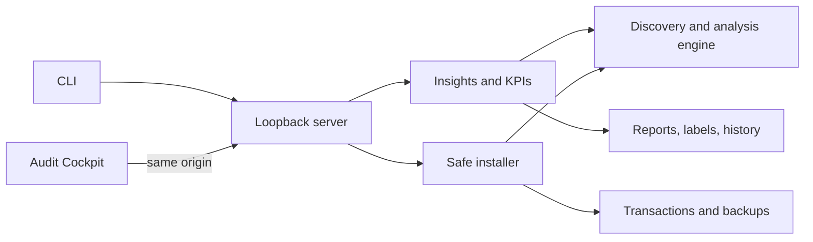

# Architecture

Skill Steward is a local-first TypeScript monorepo. Domain packages remain independent from the browser so the same analysis and installation rules serve the CLI, Web UI, tests, and future adapters.

## Package boundaries

- `packages/engine` owns discovery, parsing, fingerprints, findings, overlap analysis, and the shared harness root catalog.
- `packages/insights` converts reports into deterministic health and KPI presentation models.
- `packages/store` owns validated, atomic local reports, bounded scan history, and finding labels.
- `packages/installer` owns source staging, ZIP/Git safeguards, candidate inspection, destination plans, atomic transactions, journaling, and rollback.
- `packages/dashboard-server` owns the loopback security boundary and versioned API.
- `apps/dashboard` owns React routes, localization, themes, responsive behavior, and browser-local preferences.
- `packages/cli` bundles the server and hashed dashboard assets into the distributable command.

## Trust boundaries

The browser never reads the filesystem directly. Mutation requests require a random in-memory token injected into the same-origin SPA. Installation sources are staged and validated before a plan is created; source content is never executed. A plan records expected source and destination fingerprints and is revalidated immediately before mutation.

## Local state

The default state directory is `~/.skill-steward`, configurable with `SKILL_STEWARD_HOME`. It contains reports, bounded history, finding labels, installation previews, and the transaction journal. Replacement backups live in a same-filesystem transaction directory so rename operations remain atomic.
