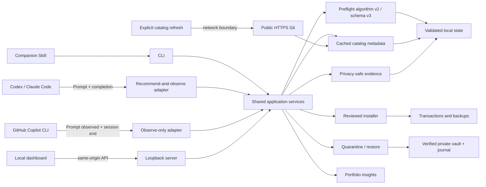

# Architecture

Skill Steward is a local-first TypeScript monorepo. It is a control plane around Agent Skills, not an agent Harness. Codex, Claude Code, GitHub Copilot, and other supported tools continue to execute tasks and Skills.

## Package boundaries

- `packages/engine` owns root discovery, parsing, fingerprints, findings, overlap analysis, and the shared Harness root catalog.
- `packages/insights` converts reports into deterministic health and KPI presentation models.
- `packages/catalog` defines source metadata, disabled presets, Git refresh, last-known-good behavior, candidate identity, and installation reinspection. It does not persist data itself.
- `packages/preflight` combines installed and cached catalog candidates, then applies relevance, coverage, risk, redundancy, compatibility, and installation penalties. It has no filesystem or network I/O.
- `packages/evidence` defines strict content-free evidence, policy, lifecycle, metric, breakdown, and readiness schemas plus pure aggregation.
- `packages/integrations` defines compact Hook protocols, the shared capability matrix, transactional Codex/Claude/Copilot configuration, trust status, and companion-Skill file operations.
- `packages/store` owns validated atomic reports, catalog metadata, bounded history, labels, integration records, privacy-reduced preflights, private HMAC salt, bounded lifecycle events, export, compaction, and erase.
- `packages/installer` owns source staging, ZIP/Git safeguards, inspection, destination plans, atomic transactions, journaling, and rollback.
- `packages/governance` owns exact quarantine/restore plans, verified vault transactions, failure recovery, and the append-only governance journal.
- `packages/dashboard-server` composes those packages behind a loopback security boundary and versioned API.
- `apps/dashboard` is a dashboard and configuration client. It does not contain a second analysis or mutation implementation.
- `packages/cli` exposes the same services headlessly and bundles the dashboard plus companion Skill.

## Task-time data flow

The Codex and Claude Code adapters run `skill-steward hook prompt` when a user submits a prompt. The command reads the latest installed-portfolio report and cached catalog index, calls deterministic Preflight algorithm v2, and emits at most 2,048 bytes of additional context. Their completion Hooks record content-free turn/session reasons only in opt-in learning mode. Invalid input, missing state, timeout, HMAC failure, or evidence-write failure returns protocol-valid non-blocking JSON so the Harness continues normally.

GitHub Copilot CLI uses a separate observe-only adapter. Its dedicated `~/.copilot/hooks/skill-steward.json` file observes `userPromptSubmitted` and `sessionEnd`, always returns `{}`, and never injects recommendation context. The companion Skill or explicit CLI remains its recommendation surface. This distinction is encoded in the capability model instead of inferred by the UI.

Task-time analysis never refreshes catalogs. Network access occurs only when a user explicitly runs `catalog refresh` or confirms the equivalent dashboard action. A refresh stages enabled public HTTPS Git sources with repository Hooks and submodules disabled, validates every candidate, and atomically replaces the metadata index. Failed sources retain last-known-good records and receive a stale/error status.

## Trust boundaries

The browser never reads the filesystem directly. Mutation requests require a random in-memory token injected into the same-origin SPA. The server binds to loopback and rejects unexpected Host and Origin values.

Catalog entries contain routing metadata, fingerprints, scripts, findings, compatibility, source ID, and revision—not full Skill bodies. “Vendor”, “community”, and “user” are source classifications, not safety decisions. Before an available candidate can be installed, Skill Steward checks out the recorded revision, reinspects it, compares identity and fingerprint, and generates a separate destination plan. No recommendation is committed without confirmation.

Codex and Claude Code integration changes are structural JSON merges. Copilot owns only its dedicated managed Hook file. Existing unrelated settings and files survive. Apply and remove operations record fingerprints in `integrations.json` and stop on drift; Codex/Claude create adjacent backups when an existing configuration changes. Codex reports `needs-trust` until its native Hook trust flow has been completed.

Evidence defaults to `minimal`. A fingerprint-bound, expiring plan is required before enabling `learning`, which adds numeric candidate features and HMAC-pseudonymous lifecycle events. Raw prompts, terms, paths, Harness IDs, transcripts, assistant content, and tool data are not valid evidence schema fields. The 32-byte salt is private, is never exported, and is removed only by an exact evidence-erase plan.

Governance mutations also require exact ten-minute plans. Quarantine verifies a private staging copy before moving the active Skill, commits a vault copy, journals the transaction, and only then cleans rollback data. Restore refuses destination conflicts and vault drift. Failure recovery preserves at least one fingerprint-verified copy at every injected boundary. There is no permanent-delete operation in the governance package, CLI, API, or dashboard.

## Local state

The default state directory is `~/.skill-steward`, configurable with `SKILL_STEWARD_HOME`.

| File or directory | Purpose |
|---|---|
| `latest-report.json`, `previous-report.json`, `history/` | Installed portfolio reports and bounded history |
| `catalog-sources.json` | Up to eight source definitions; built-in sources start disabled |
| `catalog-index.json` | Validated local metadata snapshot and per-source refresh state |
| `preflights.json` | Up to 200 privacy-reduced recommendation/feedback records |
| `evidence-policy.json` | Minimal/learning mode, 7–365 day retention, and 100–10,000 lifecycle-event limit |
| `evidence-salt` | Private 32-byte per-install HMAC secret; never exported |
| `evidence-events.jsonl` | Bounded content-free delivery, lifecycle, installation, and governance evidence |
| `integrations.json` | Up to 100 apply/remove records and configuration fingerprints |
| `installations.jsonl` | Installation and rollback transaction journal |
| `governance.jsonl` | Append-only quarantine, restore, and failed-boundary records |
| `quarantine/` | Private verified Skill copies used for recoverable restore |
| staging directories | Short-lived inspection previews, removed on expiry |

Files containing local evidence and journals are written with mode `0600`; private state containers use `0700`. Preflight persistence excludes raw task text, extracted terms, candidate descriptions, reason details, source URLs, and local paths. Sanitized evidence exports contain the same allow-listed pseudonymous records but never the salt. Replacement backups live beside the destination under `.skill-steward-backups`; Harness configuration backups live beside the changed configuration file.

## Measurement and calibration boundary

Evidence aggregation reports explicit feedback rates, corrected-set precision/recall/F1, explicit-provenance install conversion, lifecycle reasons, and Harness/algorithm/7-day/30-day breakdowns. Lifecycle reasons are operational proxies, not labels and not a task-success rate. A dataset is only marked ready for calibration review at 100 labeled preflights, 30 corrected sets, and 20 portfolio fingerprints. Readiness does not activate a learned profile or mutate Preflight weights; calibration requires a separate reviewed release.

## Extension model

Adding a root convention is separate from adding a native workflow adapter. A Harness can be supported for inventory and installation without claiming prompt-time Hook support. Every future native adapter must define its input/output protocol, trust model, timeout behavior, reversible configuration merge, and temporary-HOME integration tests.
