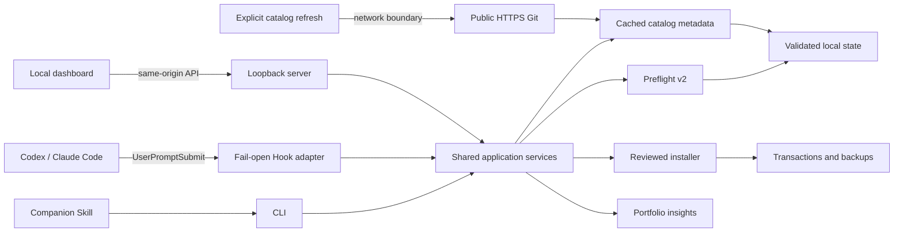

# Architecture

Skill Steward is a local-first TypeScript monorepo. It is a control plane around Agent Skills, not an agent Harness. Codex, Claude Code, GitHub Copilot, and other supported tools continue to execute tasks and Skills.

## Package boundaries

- `packages/engine` owns root discovery, parsing, fingerprints, findings, overlap analysis, and the shared Harness root catalog.
- `packages/insights` converts reports into deterministic health and KPI presentation models.
- `packages/catalog` defines source metadata, disabled presets, Git refresh, last-known-good behavior, candidate identity, and installation reinspection. It does not persist data itself.
- `packages/preflight` combines installed and cached catalog candidates, then applies relevance, coverage, risk, redundancy, compatibility, and installation penalties. It has no filesystem or network I/O.
- `packages/integrations` defines compact Hook protocols, transactional Codex/Claude Code configuration, trust status, and companion-Skill file operations.
- `packages/store` owns validated atomic reports, catalog metadata, bounded history, labels, integration records, and privacy-reduced preflight evidence.
- `packages/installer` owns source staging, ZIP/Git safeguards, inspection, destination plans, atomic transactions, journaling, and rollback.
- `packages/dashboard-server` composes those packages behind a loopback security boundary and versioned API.
- `apps/dashboard` is a dashboard and configuration client. It does not contain a second analysis or mutation implementation.
- `packages/cli` exposes the same services headlessly and bundles the dashboard plus companion Skill.

## Task-time data flow

The Codex and Claude Code adapters run `skill-steward hook prompt` when a user submits a prompt. The command reads the latest installed-portfolio report and the cached catalog index, calls Preflight v2, and emits at most 2,048 bytes of additional context. Invalid input, missing state, timeout, or analysis failure returns an empty JSON object so the Harness continues normally.

Task-time analysis never refreshes catalogs. Network access occurs only when a user explicitly runs `catalog refresh` or confirms the equivalent dashboard action. A refresh stages enabled public HTTPS Git sources with repository Hooks and submodules disabled, validates every candidate, and atomically replaces the metadata index. Failed sources retain last-known-good records and receive a stale/error status.

## Trust boundaries

The browser never reads the filesystem directly. Mutation requests require a random in-memory token injected into the same-origin SPA. The server binds to loopback and rejects unexpected Host and Origin values.

Catalog entries contain routing metadata, fingerprints, scripts, findings, compatibility, source ID, and revision—not full Skill bodies. “Vendor”, “community”, and “user” are source classifications, not safety decisions. Before an available candidate can be installed, Skill Steward checks out the recorded revision, reinspects it, compares identity and fingerprint, and generates a separate destination plan. No recommendation is committed without confirmation.

Codex and Claude Code integration changes are structural JSON merges. Existing unrelated settings survive. Apply and remove operations write adjacent timestamped `.bak` files, record fingerprints in `integrations.json`, and stop on drift. Codex reports `needs-trust` until its native Hook trust flow has been completed.

## Local state

The default state directory is `~/.skill-steward`, configurable with `SKILL_STEWARD_HOME`.

| File or directory | Purpose |
|---|---|
| `latest-report.json`, `previous-report.json`, `history/` | Installed portfolio reports and bounded history |
| `catalog-sources.json` | Up to eight source definitions; built-in sources start disabled |
| `catalog-index.json` | Validated local metadata snapshot and per-source refresh state |
| `preflights.json` | Up to 200 privacy-reduced recommendation/feedback records |
| `integrations.json` | Up to 100 apply/remove records and configuration fingerprints |
| `installations.jsonl` | Installation and rollback transaction journal |
| staging directories | Short-lived inspection previews, removed on expiry |

Files containing local evidence are written with mode `0600`. Preflight persistence excludes raw task text, extracted terms, candidate descriptions, reason details, source URLs, and local paths. Replacement backups live beside the destination under `.skill-steward-backups`; Harness configuration backups live beside the changed configuration file.

## Extension model

Adding a root convention is separate from adding a native workflow adapter. A Harness can be supported for inventory and installation without claiming prompt-time Hook support. Every future native adapter must define its input/output protocol, trust model, timeout behavior, reversible configuration merge, and temporary-HOME integration tests.
